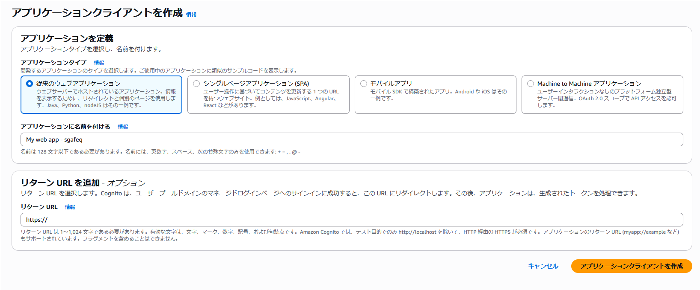

# setup_auth-and-token-verify

## ユーザープール作成

全ての操作について再現性を高めるために最終的なリソース作成は可能な範囲で aws-cli でのコマンド操作によって行うことにする

<details>
<summary>画面上の操作を確認</summary>

1. Cognito の画面でユーザープール一覧を表示


2. 「ユーザープールを作成」を押下した先の画面


- この画面でユーザープールを作成すると入力した内容を元にアプリクライアントも1つ作成される（はず）

</details>

---

1. ユーザープールを作成

```bash
$ USER_POOL_NAME=test-userpool

$ aws cognito-idp create-user-pool \
  --pool-name ${USER_POOL_NAME} \
  --username-attributes "email" \
  --policies 'PasswordPolicy={MinimumLength=8,RequireUppercase=true,RequireLowercase=true,RequireNumbers=true,RequireSymbols=false}'
```

- username-attributes オプションで認証に使用するIDをメールアドレスのみとする
- policies オプションでパスワードポリシーをカスタマイズ（少なくとも1つの特殊文字を含むことを強要するオプションを無効化）

---

## ユーザー作成

- 今回は架空の demo@example.com というメールアドレスのユーザーを作成する
- メール送信を含む検証（パスワードリセットとか）で使いまわす場合は自身が保有する実在するメールアドレスを入力すること

---

1. ユーザーを作成

```bash
$ USER_POOL_ID=[先ほどの手順で作成したユーザープールID]
$ USER_EMAIL=demo@example.com

$ aws cognito-idp admin-create-user \
  --user-pool-id ${USER_POOL_ID} \
  --username ${USER_EMAIL} \
  --user-attributes Name=email,Value=${USER_EMAIL} Name=email_verified,Value=true \
  --message-action SUPPRESS
```

確認ステータスが `パスワードを強制的に変更` の状態で出来上がる


以下のようなレスポンスが得られる

```json
{
    "User": {
        "Username": "17f4ca48-f001-70aa-e580-1eb209721ebf",
        "Attributes": [
        "UserCreateDate": "2025-06-28T09:51:58.856000+00:00",
        "UserLastModifiedDate": "2025-06-28T09:51:58.856000+00:00",
        "Enabled": true,
        "UserStatus": "FORCE_CHANGE_PASSWORD"
    }
}
```

---

2. パスワード設定＆確認ステータスを「パスワードを強制的に変更 ⇒ 検証済み」に更新する

```bash
$ USER_PASSWORD=Aaaa1111

$ aws cognito-idp admin-set-user-password \
    --user-pool-id ${USER_POOL_ID} \
    --username ${USER_EMAIL} \
    --password ${USER_PASSWORD} \
    --permanent
```

- permanent オプションを付けることで確認ステータスを「パスワードを強制的に変更 ⇒ 検証済み」に更新
- username オプションで更新対象のユーザーを指定する
  - 今回作成したユーザープールではメールアドレスが唯一のサインインのための識別子であることからメールアドレスで一意なユーザーを引いての更新が可能だったかも？
  - 本来であればユーザー名（UUID）をセットする模様？

---

## アプリケーションクライアント作成

<details>
<summary>画面上の操作を確認</summary>

- アプリケーションクライアントを画面から作成する場合、4つのタイプから選択することになる
- 「アプリケーションクライアント名」と「リターンURL」のみ入力可能となっており細かい認証フローや有効期限などの調整は作成後に編集から実施することになる



---

以下、アプリケーションクライアントを画面から作成したときの直後の状態についてタイプ別でまとめる

`※いずれのタイプを選んだ場合でも USER_PASSWORD_AUTH 認証フローはデフォルトでは有効化されていない`

---

**従来のウェブアプリケーション** を選択した場合


- クライアントシークレットが生成されている（`--generate-secret`）
- 認証フローは "ALLOW_USER_AUTH" "ALLOW_USER_SRP_AUTH" "ALLOW_REFRESH_TOKEN_AUTH" が選択されている
- ページ下部に表示されるクイックスタートガイドがサーバーサイドでのクライアントシークレットを使用することを想定したコードになっている

---

**シングルページアプリケーション(SPA)** を選択した場合


- クライアントシークレットが生成されていない（`--no-generate-secret`）
- 認証フローは "ALLOW_USER_AUTH" "ALLOW_USER_SRP_AUTH" "ALLOW_REFRESH_TOKEN_AUTH" が選択されている
- ページ下部に表示されるクイックスタートガイドが SPA ライクになっている

---

**モバイルアプリ** を選択した場合


- クライアントシークレットが生成されていない（`--no-generate-secret`）
- 認証フローは "ALLOW_USER_AUTH" "ALLOW_USER_SRP_AUTH" "ALLOW_REFRESH_TOKEN_AUTH" が選択されている
- ページ下部に表示されるクイックスタートガイドが Android / iOS のモバイルアプリ用になっている

---

**Machine to Machine アプリケーション** を選択した場合


- クライアントシークレットが生成されている（`--generate-secret`）
- 認証フローは "ALLOW_REFRESH_TOKEN_AUTH" のみが選択されている
- ページ下部に表示されるクイックスタートガイドがマシンからマシンへのユーザーの入力を介さない認証を想定したコードになっている

---

また、**従来のウェブアプリケーション、シングルページアプリケーション、モバイルアプリ** を選択した場合は「ログインページ」タブでマネージドなログインページが自動作成されていることも確認できる


**Machine to Machine アプリケーション** のみステータスが「使用不可」となっている


---

マネージドログインページで正しい認証情報を入力すると認証成功の表示が得られる（リターンURLが空なのでこの画面が表示されたという表示もある）


</details>

---

1. アプリケーションクライアントを作成

```bash
$ USER_POOL_CLIENT_NAME=test-userpool-client

$ aws cognito-idp create-user-pool-client \
  --user-pool-id ${USER_POOL_ID} \
  --client-name ${USER_POOL_CLIENT_NAME} \
  --explicit-auth-flows "ALLOW_USER_PASSWORD_AUTH" \
  --no-generate-secret
```

- 認証フローは今回は最小（ALLOW_USER_PASSWORD_AUTH のみ）の構成とする
- `--no-generate-secret` でクライアントシークレットを生成しないブラウザからの認証に則したアプリクライアントとする

---

以下のようなレスポンスが得られた

```json
{
    "UserPoolClient": {
        "UserPoolId": "ap-northeast-1_*********",
        "ClientName": "test-userpool-client",
        "ClientId": "2e159j8gaq2h6a75a3v2fes67s",
        "LastModifiedDate": "2025-07-02T02:40:17.245000+00:00",
        "CreationDate": "2025-07-02T02:40:17.245000+00:00",
        "RefreshTokenValidity": 30,
        "TokenValidityUnits": {},
        "ExplicitAuthFlows": [
            "ALLOW_USER_PASSWORD_AUTH"
        ],
        "AllowedOAuthFlowsUserPoolClient": false,
        "EnableTokenRevocation": true,
        "EnablePropagateAdditionalUserContextData": false,
        "AuthSessionValidity": 3
    }
}
```

- `UserPoolClient.ClientId` の値がアプリクライアントのID（作成中の認証ページの設定で使用する）

---

画面から見た作成したアプリクライアントは以下


- 認証フローについて `ALLOW_USER_PASSWORD_AUTH` のみが設定されている
- リフレッシュトークンの有効期限が 30 日と画面から作ったとき（5日）と比べて長くなっている
  - なお今回は認証フローにて `ALLOW_REFRESH_TOKEN_AUTH` を追加していないため、実際にはリフレッシュトークンを使用した再認証は使用不可（のはず）


- マネージドログインページの設定も行っていないのでステータスが「使用不可」となっている

<details>
<summary>マネージドログインページを設定する場合</summary>

今回は使用しないが画面から作成したアプリケーションクライアントと同等のものを作りたい場合についてどのようなオプションが必要となるかを調べたところ以下のように OAuth 関連の設定が必要なことがわかった

```bash
$ aws cognito-idp create-user-pool-client \
  --user-pool-id ${USER_POOL_ID} \
  --client-name ${USER_POOL_CLIENT_NAME} \
  --explicit-auth-flows "ALLOW_USER_PASSWORD_AUTH" "ALLOW_USER_AUTH" \
  --no-generate-secret \
  --allowed-o-auth-flows-user-pool-client \
  --supported-identity-providers "COGNITO" \
  --allowed-o-auth-flows "code" \
  --allowed-o-auth-scopes "openid" "email" \
  --callback-urls "https://imo-tikuwa.github.io/cognito-demo/callback.html"
```

以下のようなレスポンスが得られたらおそらく使用可能

```json
{
    "UserPoolClient": {
        "UserPoolId": "ap-northeast-1_*********",
        "ClientName": "test-userpool-client",
        "ClientId": "172tc3ivsb8ap64ohsban8rdvc",
        "LastModifiedDate": "2025-07-02T03:06:24.683000+00:00",
        "CreationDate": "2025-07-02T03:06:24.683000+00:00",
        "RefreshTokenValidity": 30,
        "TokenValidityUnits": {},
        "ExplicitAuthFlows": [
            "ALLOW_USER_PASSWORD_AUTH"
        ],
        "SupportedIdentityProviders": [
            "COGNITO"
        ],
        "CallbackURLs": [
            "https://imo-tikuwa.github.io/cognito-demo/callback.html"
        ],
        "AllowedOAuthFlows": [
            "code"
        ],
        "AllowedOAuthScopes": [
            "openid",
            "email"
        ],
        "AllowedOAuthFlowsUserPoolClient": true,
        "EnableTokenRevocation": true,
        "EnablePropagateAdditionalUserContextData": false,
        "AuthSessionValidity": 3
    }
}
```

- 画面から作成したときにコールバックURLについて CloudFront の URL が設定されてたがアレを設定する方法は不明？
- 認証後のリダイレクト先のURLを入力するので用途に合わせて適宜入力する必要がある

</details>

## ここまでの動作確認

ここまでで作成した **ユーザープール**、**Cognito ユーザー**、**アプリケーションクライアント** を元に最低限のメールアドレス / パスワードの認証が可能

1. 認証デモページにアクセス


2. 「Cognito 設定」欄を開き作成したユーザープールとアプリケーションクライアントの情報を入力して「設定を確認」を押下


3. メールアドレス / パスワード を入力して「ログイン」を押下


4. 認証に成功した場合、IDトークン（JWT）をデコードした中身を確認可


## 参考サイト

認証フローについて USER_PASSWORD_AUTH と USER_SRP_AUTH って何が違うのかを調べたときに読んだページ

- https://qiita.com/ishiyama0530/items/426dc3f76f68bf586c28
- https://qiita.com/faable01/items/ceb7678d5e00917eb0c9

今回の検証では SRP_A を取得するのに [amazon-cognito-identity-js](https://www.npmjs.com/package/amazon-cognito-identity-js) のインポートが大変そうだったので、認証フローはシンプルな `USER_PASSWORD_AUTH` にした

---

CLI操作の参考にしたページ

- https://dev.classmethod.jp/articles/quickly-create-an-authentication-function-with-amazon-cognito-userpool-with-the-aws-cli/

