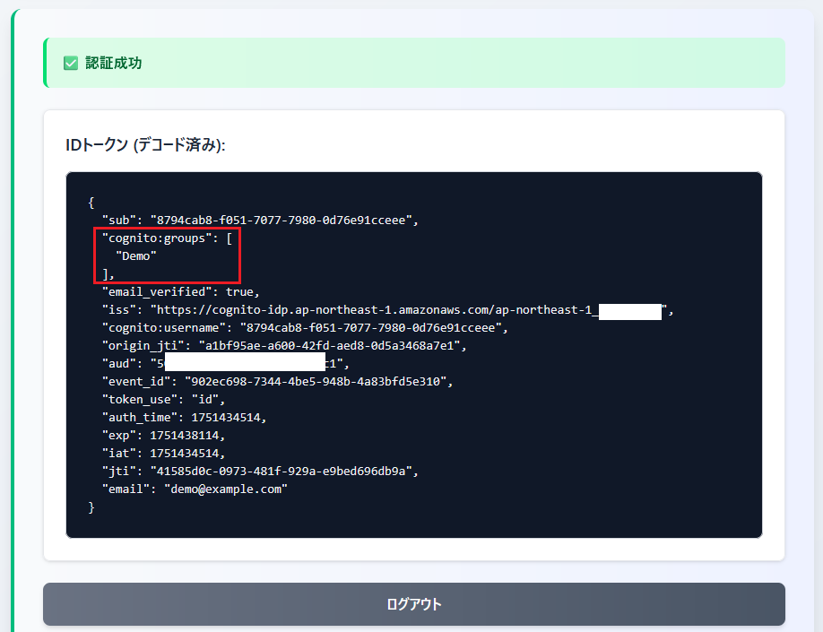

# setup_auth-and-token-verify2

setup_auth-and-token-verify.md の続き

- 追加で **ユーザープールのグループ作成** や **グループに所属するユーザー作成** などを実施する
- グループに設定した IAM ロールが削除できないことなどを確認する

## グループ作成

```bash
$ aws cognito-idp create-group \
  --user-pool-id ${USER_POOL_ID} \
  --group-name Demo
```

- まずは IAM ロール（`--role-arn`）なしで作成

---

以下のようなレスポンスを得られれば正常に実行できている（はず）

```json
{
    "Group": {
        "GroupName": "Demo",
        "UserPoolId": "ap-northeast-1_*********",
        "LastModifiedDate": "2025-07-02T05:14:34.600000+00:00",
        "CreationDate": "2025-07-02T05:14:34.600000+00:00"
    }
}
```

## グループにユーザーを追加

Demo というグループを作成する

```bash
$ USER_EMAIL=demo@example.com

$ aws cognito-idp admin-add-user-to-group \
  --user-pool-id ${USER_POOL_ID} \
  --group-name Demo \
  --username ${USER_EMAIL}
```

- `--username` にグループに含めたいユーザーの情報（今回はメールアドレス）を指定
- メールアドレスを入力してコマンドを完遂できるのはメールアドレスをユーザー名として使っている場合のみ（と考えられる）
- 通常はユーザー名（UUID）を指定する
- 戻り値として正常に追加できたかなどは返さない
  - 何も表示されず、1つ前のコマンドの終了コード（`echo $?`）が 0 なら正常に実行できたと見なしてよさそう？

## ここまでの動作確認

1. 認証デモページで認証を実施



- 新規でIDトークンの中に `cognito:groups` クレームが追加されたことを確認
- このクレームの情報を元に ID トークンの設定によって異なるIAMロールを割り当てるといったことが可能
