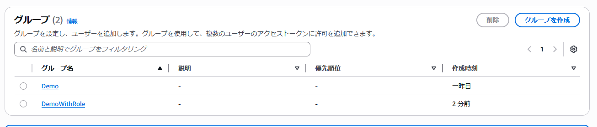
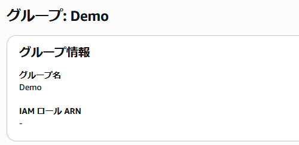
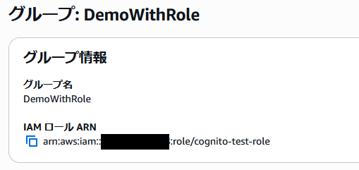
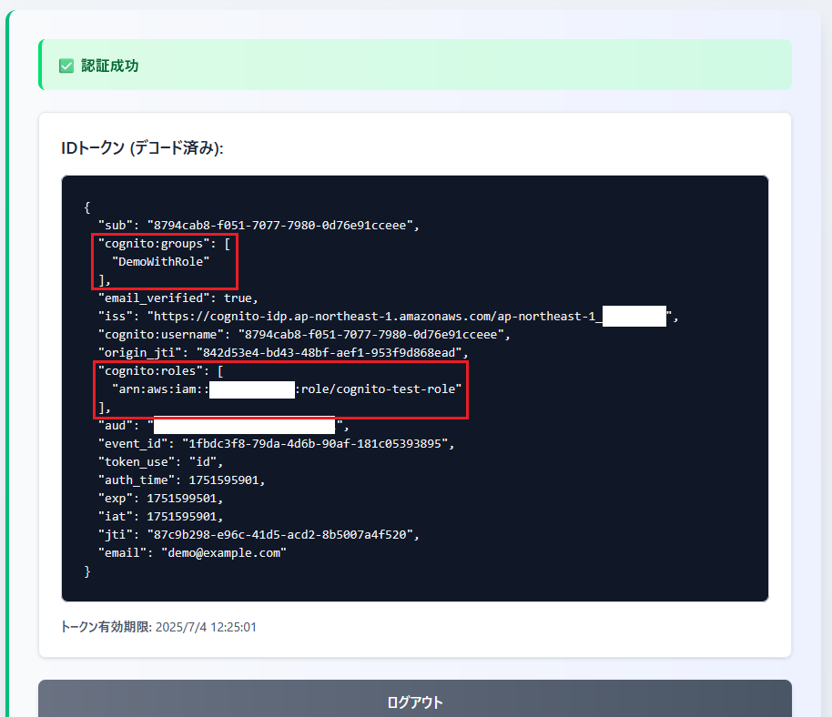
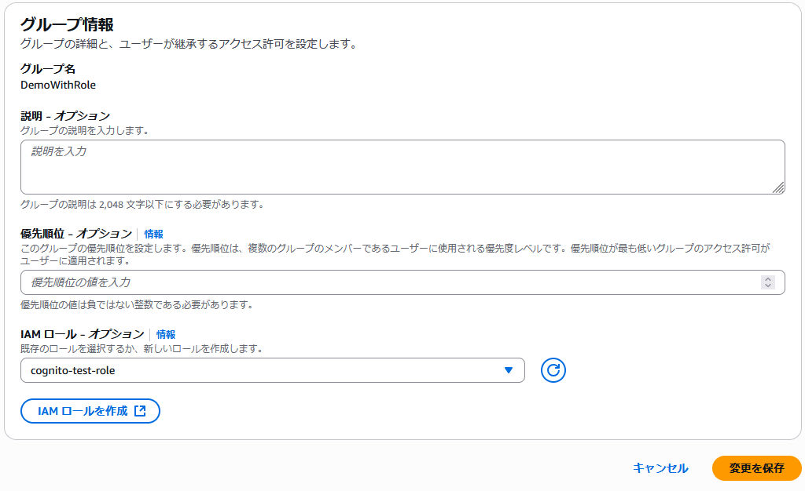
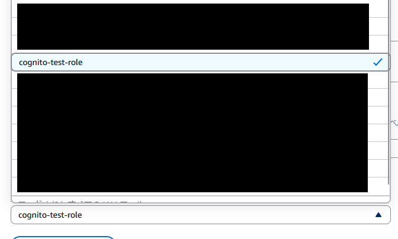
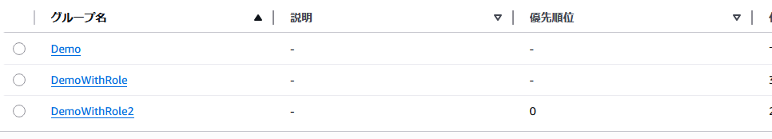
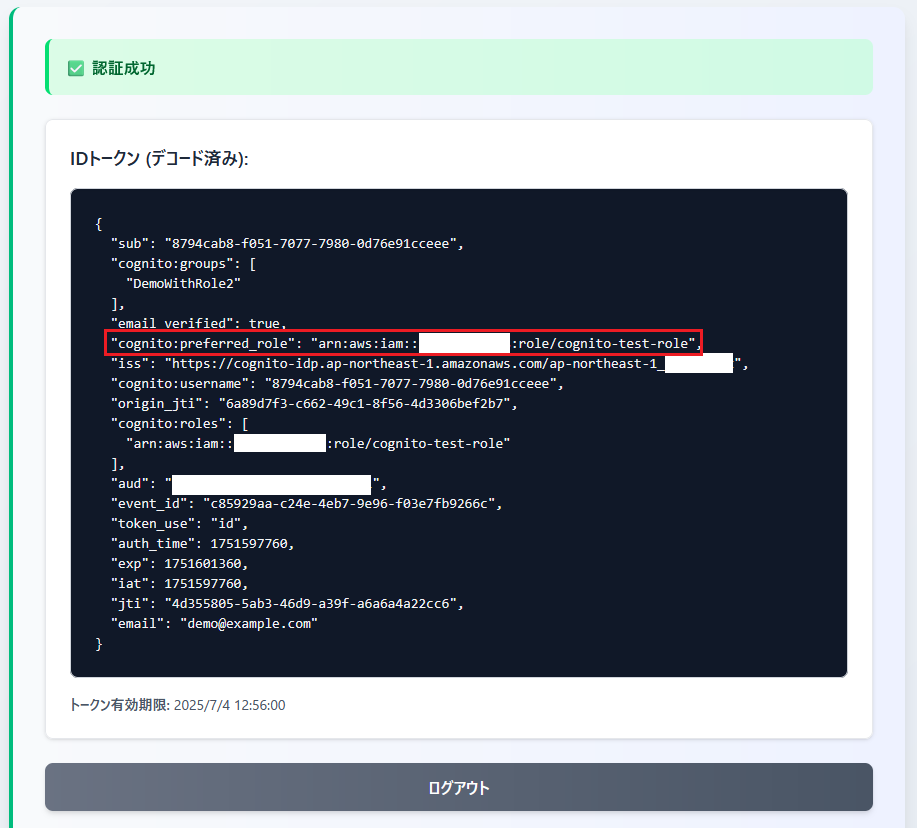

# setup_auth-and-token-verify3

setup_auth-and-token-verify2.md の続き

今度は適当なIAMロールを作成してそのロールARNを紐づけたグループを作成する

- ユーザープールのグループに設定する IAM ロールは **ID プールを信頼するような「信頼ポリシー」の設定が必須**
- 適当とはいえ IAM ロールについて全てを空としたようなものは作成できず、1つ以上の信頼ポリシーの設定を行う必要がある
- この検証では `cognito:roles`、`cognito:preferred_role` クレームが ID トークンに付与されることまでを検証することを目的としている
- そのため作成する IAM ロールについて紐づけるIAMポリシーは**設定せず**、信頼ポリシーについて最低限度（**認証済みであること**）のみを条件とする設定で作成する

## IAM ロール作成

cognito-test-role という IAM ロールを作成する

```bash
$ aws iam create-role \
  --role-name cognito-test-role \
  --assume-role-policy-document '{
    "Version": "2012-10-17",
    "Statement": [
      {
        "Effect": "Allow",
        "Principal": {
          "Federated": "cognito-identity.amazonaws.com"
        },
        "Action": "sts:AssumeRoleWithWebIdentity",
        "Condition": {
          "ForAnyValue:StringLike": {
            "cognito-identity.amazonaws.com:amr": "authenticated"
          }
        }
      }
    ]
  }'
```

- IAM ロールに対する許可は create-role コマンドでは設定できない（put-role-policy コマンドを使用する）
- `--assume-role-policy-document` オプションで信頼ポリシーを設定する

---

以下のようなレスポンスが得られた（IDとAWSアカウントID部分はマスク済）

```json
{
    "Role": {
        "Path": "/",
        "RoleName": "cognito-test-role",
        "RoleId": "AROAXW4MGBW**********",
        "Arn": "arn:aws:iam::************:role/cognito-test-role",
        "CreateDate": "2025-07-04T01:32:43+00:00",
        "AssumeRolePolicyDocument": {
            "Version": "2012-10-17",
            "Statement": [
                {
                    "Effect": "Allow",
                    "Principal": {
                        "Federated": "cognito-identity.amazonaws.com"
                    },
                    "Action": "sts:AssumeRoleWithWebIdentity",
                    "Condition": {
                        "ForAnyValue:StringLike": {
                            "cognito-identity.amazonaws.com:amr": "authenticated"
                        }
                    }
                }
            ]
        }
    }
}
```

## ロールARN付きのグループ作成

DemoWithRole というグループを作成する

```bash
$ ROLE_ARN=arn:aws:iam::************:role/cognito-test-role
$ USER_POOL_ID=[ユーザープールID]

$ aws cognito-idp create-group \
  --user-pool-id ${USER_POOL_ID} \
  --group-name DemoWithRole \
  --role-arn ${ROLE_ARN}
```

- `--role-arn` オプションで先ほど作成した IAM ロール の ロール ARN を設定する

---

以下のようなレスポンスが得られた（ユーザープールIDの一部とAWSアカウントID部分はマスク済）

```json
{
    "Group": {
        "GroupName": "DemoWithRole",
        "UserPoolId": "ap-northeast-1_*********",
        "RoleArn": "arn:aws:iam::************:role/cognito-test-role",
        "LastModifiedDate": "2025-07-04T02:15:14.858000+00:00",
        "CreationDate": "2025-07-04T02:15:14.858000+00:00"
    }
}
```

AWS の画面で見た様子







- Demo グループと見比べて IAM ロール ARN が設定されてることを確認

## ユーザーにグループを付け替える

setup_auth-and-token-verify.md の手順の中で作成したユーザー（`demo@example.com`）について Demo グループに所属する状態なので一度グループから削除してから新しく作成したグループに追加する

```bash
$ aws cognito-idp admin-remove-user-from-group \
  --user-pool-id ${USER_POOL_ID} \
  --username demo@example.com \
  --group-name Demo

$ aws cognito-idp admin-add-user-to-group \
  --user-pool-id ${USER_POOL_ID} \
  --username demo@example.com \
  --group-name DemoWithRole
```

## ここまでの動作確認

1. 認証デモページで認証を実施



- Demo グループに所属してたときに確認したものとと比べて `cognito:roles` クレームが追加されたことを確認
- `cognito:preferred_role` クレームは存在しないみたい？

## 備考1 - グループに設定したロールARNが削除できない？？

以下はマネジメントコンソール上で Cognito グループを編集する画面を開いた状態



プルダウンについて空にすることができない模様。。



---

aws-cli からのコマンド操作でも削除不可（エラーになる）

```bash
$ aws cognito-idp update-group \
  --user-pool-id ${USER_POOL_ID} \
  --group-name DemoWithRole \
  --role-arn ""

Parameter validation failed:
Invalid length for parameter RoleArn, value: 0, valid min length: 20
```

参考：https://stackoverflow.com/questions/66659859/how-to-delete-a-role-arn-assigned-to-a-cognito-user-pool-group

## 備考2 - cognito:preferred_role クレームが含まれない件の調査

`cognito:preferred_role` クレームがIDトークンに含まれない件について優先順位（`--precedence`）を設定しなかったことが原因かもしれないので検証してみる

DemoWithRole2 というグループを作成する

```bash
$ aws cognito-idp create-group \
  --user-pool-id ${USER_POOL_ID} \
  --group-name DemoWithRole2 \
  --precedence 0 \
  --role-arn ${ROLE_ARN}
```

- 優先順位の値は負ではない整数である必要がある模様

---

以下のようなレスポンスが得られた

```json
{
    "Group": {
        "GroupName": "DemoWithRole2",
        "UserPoolId": "ap-northeast-1_*********",
        "RoleArn": "arn:aws:iam::************:role/cognito-test-role",
        "Precedence": 0,
        "LastModifiedDate": "2025-07-04T02:50:29.854000+00:00",
        "CreationDate": "2025-07-04T02:50:29.854000+00:00"
    }
}
```

- DemoWithRole グループを作成したときのものと見比べて Precedence が追加されたことを確認

---

画面で見た状態



---

検証用ユーザーについてグループを DemoWithRole ⇒ DemoWithRole2 に付け替える

```bash
$ aws cognito-idp admin-remove-user-from-group \
  --user-pool-id ${USER_POOL_ID} \
  --username demo@example.com \
  --group-name DemoWithRole

$ aws cognito-idp admin-add-user-to-group \
  --user-pool-id ${USER_POOL_ID} \
  --username demo@example.com \
  --group-name DemoWithRole2
```

---

この状態で検証用の画面から認証しなおしたところ、今度は `cognito:preferred_role` クレームが含まれるものとなっていることを確認



---

その他、優先順位（`--precedence`）も IAM ロール（`--role-arn`）と同様で更新によって未設定の状態にすることはできない模様

```bash
$ aws cognito-idp update-group \
  --user-pool-id ${USER_POOL_ID} \
  --group-name DemoWithRole2 \
  --precedence ""

invalid literal for int() with base 10: ''

$ aws cognito-idp update-group \
  --user-pool-id ${USER_POOL_ID} \
  --group-name DemoWithRole2 \
  --precedence -1

Parameter validation failed:
Invalid value for parameter Precedence, value: -1, valid min value: 0
```

- エラーが出る
- 画面からは空欄で更新できるが値が空欄になるといったことは無い模様

## 備考のまとめ
- グループに「IAM ロール」を設定するとグループに所属するユーザーが認証した際、IDトークン（JWT）の中に `cognito:roles` クレームが追加される
- グループに「優先順位」を設定するとグループに所属するユーザーが認証した際、IDトークン（JWT）の中に `cognito:preferred_role` クレームが追加される
- Cognito グループの「IAM ロール」「優先順位」は一度設定したら削除できない

## その他

今回の検証で作成した Cognito の「ユーザープール」「ユーザー」「アプリケーションクライアント」を除くすべてのリソースについて名称がわかりづらく後続の手順の混乱の元になるため以下のリソースを削除することにした

- Demo グループ
- DemoWithRole グループ
- cognito-test-role IAM ロール

```bash
$ aws cognito-idp delete-group \
  --user-pool-id ${USER_POOL_ID} \
  --group-name Demo

$ aws cognito-idp delete-group \
  --user-pool-id ${USER_POOL_ID} \
  --group-name DemoWithRole

$ aws iam delete-role \
  --role-name cognito-test-role
```