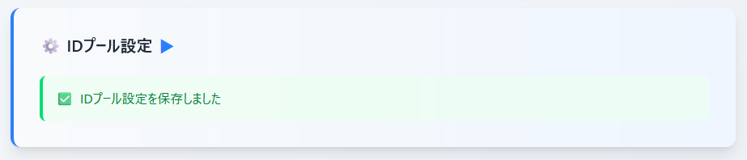

# setup_federated-identity

setup_auth-and-token-verify3.md の続き

- setup_auth-and-token-verify.md ～ setup_auth-and-token-verify3.md では主にユーザープール、ユーザー、グループを作成しての認証に関する検証を実施してきた
- 今度は前項の流れの続きとして ID プールの作成を行っての AWS リソースの情報取得を行うためのクレデンシャル発行やそのクレデンシャルが認証したユーザーごとの Admin グループ所属などの状況に則したものになっているのかの検証を実施する

## IAM ロールを2つ作成

今回は「ID プールのデフォルトの認証ロール」と、後ほど作成する「Cognito ユーザープールの Admin グループに紐づく管理者用ロール」に設定するロールの2つを作成する

| ロール名 | IAMポリシー | 備考|
| --- | --- | --- |
| cognito-test-default-role | なし | 認証したユーザーのうち Admin グループに所属しないユーザーに割り当てられる |
| cognito-test-admin-role | S3の読み取りを可能とするマネージドなポリシー（[AmazonS3ReadOnlyAccess](https://docs.aws.amazon.com/ja_jp/aws-managed-policy/latest/reference/AmazonS3ReadOnlyAccess.html)）のみ設定 | Admin グループに所属するユーザーに割り当てられる|

```bash
$ aws iam create-role \
  --role-name cognito-test-default-role \
  --assume-role-policy-document '{
    "Version": "2012-10-17",
    "Statement": [
      {
        "Effect": "Allow",
        "Principal": {
          "Federated": "cognito-identity.amazonaws.com"
        },
        "Action": "sts:AssumeRoleWithWebIdentity",
        "Condition": {
          "ForAnyValue:StringLike": {
            "cognito-identity.amazonaws.com:amr": "authenticated"
          }
        }
      }
    ]
  }'

$ aws iam create-role \
  --role-name cognito-test-admin-role \
  --assume-role-policy-document '{
    "Version": "2012-10-17",
    "Statement": [
      {
        "Effect": "Allow",
        "Principal": {
          "Federated": "cognito-identity.amazonaws.com"
        },
        "Action": "sts:AssumeRoleWithWebIdentity",
        "Condition": {
          "ForAnyValue:StringLike": {
            "cognito-identity.amazonaws.com:amr": "authenticated"
          }
        }
      }
    ]
  }'

$ aws iam attach-role-policy \
  --role-name cognito-test-admin-role \
  --policy-arn arn:aws:iam::aws:policy/AmazonS3ReadOnlyAccess
```

- ID プールに設定する IAM ロールについて信頼ポリシーは実際には **「どのIDプールからのフェデレーションを許可するか」** の設定を行う必要がある
- ただし、この時点では ID プールを作成していないためその設定を含めることができない状態となっている
- ID プール作成後に上記2ロールについて信頼ポリシーの更新を実施することで解決する（後述）

具体的には以下のような情報の追加が必要

```diff
        "Condition": {
+          "StringEquals": {
+            "cognito-identity.amazonaws.com:aud": "[IDENTITY_POOL_ID]"
+          },
          "ForAnyValue:StringLike": {
            "cognito-identity.amazonaws.com:amr": "authenticated"
          }
```

---

余談としてマネジメントコンソール上で作成済みの ID プールの「認証されたロール」を更新する画面の中で、上記ような不足のある IAM ロールを設定しようとすると以下のような警告が表示される


↓


## Admin グループ作成

ユーザープールに Admin というグループを作成する

Admin グループの IAM ロールとして先ほど ↑ の手順で作成した cognito-test-admin-role の ARN を設定する

```bash
$ ROLE_ARN=arn:aws:iam::************:role/cognito-test-admin-role
$ USER_POOL_ID=[ユーザープールID]

$ aws cognito-idp create-group \
  --user-pool-id ${USER_POOL_ID} \
  --group-name Admin \
  --precedence 0 \
  --role-arn ${ROLE_ARN}
```

## Admin グループに所属するユーザー作成

先の手順で作成済みのユーザー（`demo@example.com`）は一般扱いのユーザーとしたいため別途 Admin グループに所属するユーザー（`admin@example.com`）を作成する

```bash
$ USER_POOL_ID=[ユーザープールID]
$ USER_EMAIL=admin@example.com
$ USER_PASSWORD=Aaaa1111

$ aws cognito-idp admin-create-user \
  --user-pool-id ${USER_POOL_ID} \
  --username ${USER_EMAIL} \
  --user-attributes Name=email,Value=${USER_EMAIL} Name=email_verified,Value=true \
  --message-action SUPPRESS

$ aws cognito-idp admin-set-user-password \
  --user-pool-id ${USER_POOL_ID} \
  --username ${USER_EMAIL} \
  --password ${USER_PASSWORD} \
  --permanent

$ aws cognito-idp admin-add-user-to-group \
  --user-pool-id ${USER_POOL_ID} \
  --username ${USER_EMAIL} \
  --group-name Admin
```


## ID プールを作成

<details>
<summary>画面上の操作を確認</summary>

1. Cognito の画面で ID プール一覧を表示


2. 「IDプールを作成」を押下した先の画面


3. 「認証されたアクセス」にチェックを入れるとIDプールとして設定可能なIDソースが表示される


- 今回は「Amazon Cognito ユーザープール」のみ選択

4. ステップ2の画面でユーザーに割り当てるデフォルトの IAM ロールを設定する


5. 「既存の IAM ロールを使用」を選んだ場合の IAM ロールは信頼ポリシーとして `cognito-identity.amazonaws.com` を信頼するロールのみ選択可能


- ここの IAM ロールには Admin グループには属さないユーザーに割り当てるロール（`cognito-test-default-role`）を入力

6. ステップ3の画面でIDプロバイダーとの接続や認証したユーザーのロールの識別設定を行う


- ユーザープール ID とアプリクライアント ID を入力
- 今回はユーザープールを通して認証したユーザーについて、Adminグループに所属するユーザーかどうかで異なるクレデンシャルを返す流れを検証したいのでロールの選択は「**トークンで preferred_role クレームを持つロールを選択する**」を選択


- 今回選択した「**トークンで preferred_role クレームを持つロールを選択する**」や「**ルールを使用してロールを選択**」を選択すると **ロールの解決** という設定が下に現れる
- これはロールの選択の条件に合致しないユーザーが認証してきた場合の ID プールのふるまいを指している（と思われる）。今回は Admin グループに所属しないユーザーにはデフォルトの認証されたロール、つまりは `cognito-test-default-role` を割り当てたいので「**デフォルトの認証されたロールを使用**」を選択することになる

7. ステップ4の画面で ID プールの名前やタグ入力


</details>

---

↑ で確認した AWS マネジメントコンソール上の内容、AWS のドキュメント、AIを参考に以下のような手順で ID プールを作成する

1. [create-identity-pool](https://docs.aws.amazon.com/cli/latest/reference/cognito-identity/create-identity-pool.html) コマンドで ID プロバイダー（Cognito ユーザープール）が1件紐づいたものを作成

```bash
$ REGION=ap-northeast-1
$ USER_POOL_ID=[ユーザープールID]
$ APP_CLIENT_ID=[アプリクライアントID]

$ IDENTITY_POOL_ID=$(aws cognito-identity create-identity-pool \
  --identity-pool-name test-id-pool \
  --no-allow-unauthenticated-identities \
  --cognito-identity-providers "[{
    \"ProviderName\": \"cognito-idp.${REGION}.amazonaws.com/${USER_POOL_ID}\",
    \"ClientId\": \"${APP_CLIENT_ID}\",
    \"ServerSideTokenCheck\": false
  }]" \
  --query 'IdentityPoolId' --output text)
```

- IDENTITY_POOL_ID という変数名で ID プールの ID を参照できるようにする
- ドキュメント読んだ感じ「認証されたアクセス」や「ID プロバイダー」の詳細な設定はできなさそう？

参考：https://docs.aws.amazon.com/cli/latest/reference/cognito-identity/create-identity-pool.html

---

2. 取得した IDプールID を IAM ロールの信頼ポリシーに設定

**[## IAM ロールを2つ作成](#IAM-ロールを2つ作成) で触れていた件についてこのタイミングで実施**

```bash
$ aws iam update-assume-role-policy \
  --role-name cognito-test-default-role \
  --policy-document "{
    \"Version\": \"2012-10-17\",
    \"Statement\": [
        {
            \"Effect\": \"Allow\",
            \"Principal\": {
                \"Federated\": \"cognito-identity.amazonaws.com\"
            },
            \"Action\": \"sts:AssumeRoleWithWebIdentity\",
            \"Condition\": {
                \"StringEquals\": {
                    \"cognito-identity.amazonaws.com:aud\": \"${IDENTITY_POOL_ID}\"
                },
                \"ForAnyValue:StringLike\": {
                    \"cognito-identity.amazonaws.com:amr\": \"authenticated\"
                }
            }
        }
    ]
}"

$ aws iam update-assume-role-policy \
  --role-name cognito-test-admin-role \
  --policy-document "{
    \"Version\": \"2012-10-17\",
    \"Statement\": [
        {
            \"Effect\": \"Allow\",
            \"Principal\": {
                \"Federated\": \"cognito-identity.amazonaws.com\"
            },
            \"Action\": \"sts:AssumeRoleWithWebIdentity\",
            \"Condition\": {
                \"StringEquals\": {
                    \"cognito-identity.amazonaws.com:aud\": \"${IDENTITY_POOL_ID}\"
                },
                \"ForAnyValue:StringLike\": {
                    \"cognito-identity.amazonaws.com:amr\": \"authenticated\"
                }
            }
        }
    ]
}"
```

- cognito-test-default-role と cognito-test-admin-role の両方のロールの信頼ポリシーを更新

参考：https://docs.aws.amazon.com/cli/latest/reference/iam/update-assume-role-policy.html

---

3. [set-identity-pool-roles](https://docs.aws.amazon.com/cli/latest/reference/cognito-identity/set-identity-pool-roles.html) コマンドで ID プールの「**認証されたアクセス**」と「**ID プロバイダー**」の詳細な設定を実施

```bash
$ DEFAULT_ROLE_ARN=arn:aws:iam::************:role/cognito-test-default-role

$ aws cognito-identity set-identity-pool-roles \
  --identity-pool-id ${IDENTITY_POOL_ID} \
  --roles "{
    \"authenticated\": \"${DEFAULT_ROLE_ARN}\"
  }" \
  --role-mappings "{
    \"cognito-idp.${REGION}.amazonaws.com/${USER_POOL_ID}:${APP_CLIENT_ID}\": {
      \"Type\": \"Token\",
      \"AmbiguousRoleResolution\": \"AuthenticatedRole\"
    }
  }"
```

- 認証されたアクセス
  - 画面から作成する場合に必須入力だった IAM ロール（`cognito-test-default-role`）を選択
- ID プロバイダー
  - ロールの選択を 「**デフォルトの認証されたロールを使用**」⇒「**トークンで preferred_role クレームを持つロールを選択する**」に変更
  - ロールの解決を「**デフォルトの認証されたロールを使用**」に設定

参考：https://docs.aws.amazon.com/cli/latest/reference/cognito-identity/set-identity-pool-roles.html  
参考：https://docs.aws.amazon.com/ja_jp/cognito/latest/developerguide/role-based-access-control.html

4. ここまでで作成した ID プールについて画面で確認


- 認証されたロールとして Admin グループに所属しないユーザーに割り当てられるロール（`cognito-test-default-role`）が設定されてることを確認


- ロールの選択について「トークンの優先ロールクレームを持つロール」を選択されてることを確認

## ここまでの動作確認1

**Admin グループに所属するユーザー（admin@example.com）で確認**

1. 認証デモページで認証を実施


- ユーザーは IAM ロール設定済みの Admin グループに所属するので `cognito:preferred_role` クレームの存在を確認できる

2. 新規作成したIDプールの検証ページで ID プールIDを設定に入力

`この設定値はユーザープールの設定と同様セッションストレージで管理するので初回のみの入力でOK`


↓



3. 同画面の「クレデンシャルを検証」をクリックしてクレデンシャルの取得に成功することを確認


4. 「クリップボードに aws-cli 用の～～」をクリックしてコピーしたテキストを aws-cli の実行環境に張り付けて実行


- Admin グループに所属するユーザーとして意図した動作（**S3バケットの一覧が取得できること**）を確認できました
- 今回は CloudShell を使用しましたが aws-cli を実行可能な環境なら何でもOKのはず

## ここまでの動作確認2

**グループに所属しないユーザー（demo@example.com）で確認**

1. 認証デモページで認証を実施


2. IDプールの検証ページで「クレデンシャルを検証」をクリックしてクレデンシャルの取得に成功することを確認


3. 「クリップボードに aws-cli 用の～～」をクリックしてコピーしたテキストを aws-cli の実行環境に張り付けて実行


- Admin グループに所属しないユーザーとして意図した動作（**S3バケットの一覧が取得できないこと**）を確認できました

