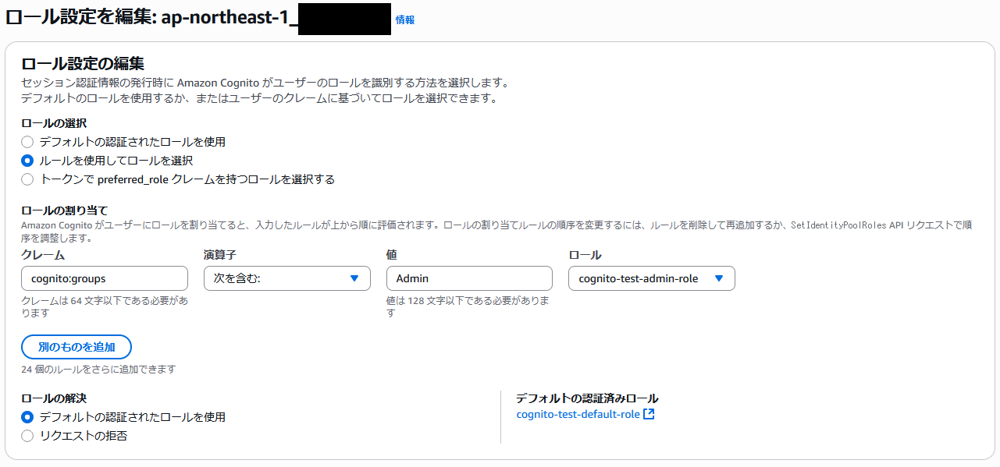
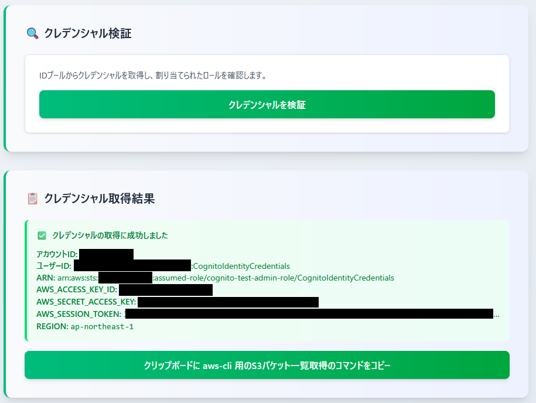

# setup_federated-identity2

setup_federated-identity.md の続き

setup_federated-identity.md では ID プールの ID プロバイダーの設定としてロールの選択で「**トークンで preferred_role クレームを持つロールを選択する**」を選択した状態での `cognito:preferred_role` クレームを元にしたロール割り当てが行えることを検証した

今回はロールの選択で「**ルールを使用してロールを選択**」を選択したルールベースのロールの割り当ての検証を実施する

---

setup_federated-identity.md で検証したものとの違いは以下の通り

- Admin グループの IAM ロール（`--role-arn`）の設定を行わない
- Admin グループに優先順位（`--precedence`）の設定を行わない
- ID プロバイダーのロールの選択で「ルールを使用してロールを選択」を選択

---

以下は AI（Claude） に作成してもらった比較画像


## Admin グループの再作成＆グループにユーザーを所属

`これまでの手順で作成した Admin グループには優先順位と IAM ロールが既に設定されている。一度設定した優先順位と IAM ロールは削除できないため作成しなおす方針とする`

```bash
$ USER_POOL_ID=[ユーザープールID]
$ USER_EMAIL=admin@example.com

$ aws cognito-idp delete-group \
  --user-pool-id ${USER_POOL_ID} \
  --group-name Admin

$ aws cognito-idp create-group \
  --user-pool-id ${USER_POOL_ID} \
  --group-name Admin

$ aws cognito-idp admin-add-user-to-group \
  --user-pool-id ${USER_POOL_ID} \
  --username ${USER_EMAIL} \
  --group-name Admin
```

上記の操作を実施した後の Admin グループは以下の通り


- IAM ロール ARN と 優先順位 が未設定になったことを確認

## ID プロバイダーのロール選択を「ルールを使用してロールを選択」に変更

```bash
$ REGION=ap-northeast-1
$ USER_POOL_ID=[ユーザープールID]
$ APP_CLIENT_ID=[アプリクライアントID]
$ IDENTITY_POOL_ID=[IDプールID]

$ DEFAULT_ROLE_ARN=arn:aws:iam::************:role/cognito-test-default-role
$ ADMIN_ROLE_ARN=arn:aws:iam::************:role/cognito-test-admin-role

$ aws cognito-identity set-identity-pool-roles \
  --identity-pool-id ${IDENTITY_POOL_ID} \
  --roles "{
    \"authenticated\": \"${DEFAULT_ROLE_ARN}\"
  }" \
  --role-mappings "{
    \"cognito-idp.${REGION}.amazonaws.com/${USER_POOL_ID}:${APP_CLIENT_ID}\": {
      \"Type\": \"Rules\",
      \"AmbiguousRoleResolution\": \"AuthenticatedRole\",
      \"RulesConfiguration\": {
        \"Rules\": [
          {
            \"Claim\": \"cognito:groups\",
            \"MatchType\": \"Contains\",
            \"Value\": \"Admin\",
            \"RoleARN\": \"${ADMIN_ROLE_ARN}\"
          }
        ]
      }
    }
  }"
```

- `--roles` は以前の設定と同一だが明示する必要がある模様。省略すると以下のようなエラーが出る

```bash
aws: error: the following arguments are required: --roles
```

---

上記の操作を実施した後の ID プロバイダーのロール設定は以下の通り



- ロールの選択が「**トークンで preferred_role クレームを持つロールを選択する**」⇒「**ルールを使用してロールを選択**」になっていることを確認
- ロールの割り当てに `cognito:groups` クレームに `Admin` を含む場合に `cognito-test-admin-role` を割り当てるルールが作成できてることを確認
  - 注意すべき点として `cognito:groups` クレームは JWT の中に**配列形式**で入っているので演算子は「次を含む（Contains）」を選択している必要があります  


## ここまでの動作確認1

**Admin グループに所属するユーザー（admin@example.com）で確認**

1. 認証デモページで認証を実施


- Admin グループについて IAM ロールと優先順位の設定を行わなかったことから `cognito:preferred_role` や `cognito:roles` などのクレームが生えないことを確認

2. IDプールの検証ページでIDプールID設定を埋めた状態で「クレデンシャルを検証」をクリックしてクレデンシャルの取得に成功することを確認



3. 「クリップボードに aws-cli 用の～～」をクリックしてコピーしたテキストを aws-cli の実行環境に張り付けて実行


- 今回も Admin グループに所属するユーザーとして意図した動作（**S3バケットの一覧が取得できること**）を確認できました

## ここまでの動作確認2

**グループに所属しないユーザー（demo@example.com）で確認**

1. 認証デモページで認証を実施


2. IDプールの検証ページで「クレデンシャルを検証」をクリックしてクレデンシャルの取得に成功することを確認


3. 「クリップボードに aws-cli 用の～～」をクリックしてコピーしたテキストを aws-cli の実行環境に張り付けて実行


- Admin グループに所属しないユーザーとして意図した動作（**S3バケットの一覧が取得できないこと**）を確認できました

## cognito:preferred_role クレームを元にしたロール割り当てと比べた感想

- 最初の構成（グループに IAM ロールと優先順位を設定）と比べると ID プール側にロールの割り当てに関するロジックが集約されていて管理しやすい（気がする）
- グループの優先順位（`--precedence`）と IAM ロール（`--role-arn`）は以前書いた通り一度設定すると削除できない。後々のことを考えるとこの辺のグループは扱いづらいのでルールベースのロール割り当てが個人的にはおすすめかも