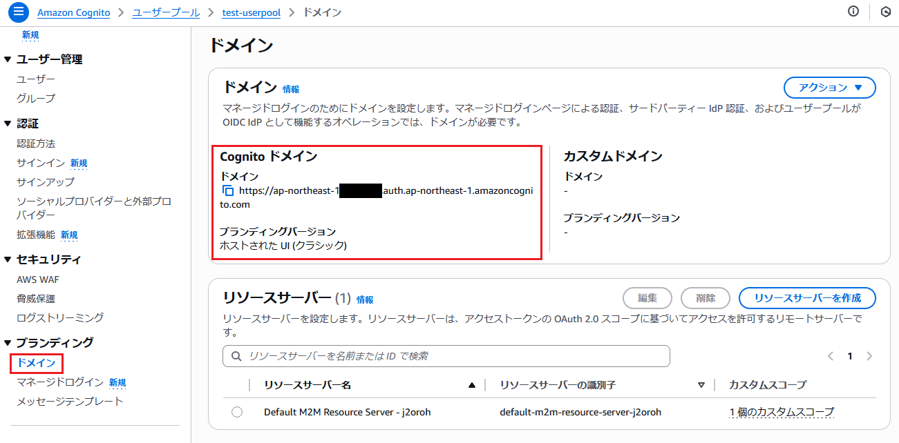
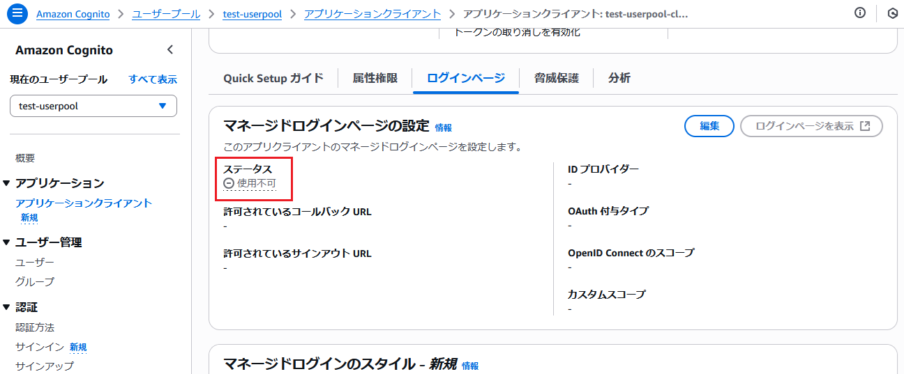

# setup_hosted-ui-login

ここからは「Hosted UI」と 2024年11月頃に提供が開始された現行の「マネージドログイン」に関する検証を進めていく

なお、これまでの手順で作成したアプリクライアントを使用します。

## 現状の設定内容を確認

作業開始前にこれまでの手順で作成したユーザープール、アプリクライアントの設定を確認する

### ユーザープールを確認

```bash
$ USER_POOL_ID=[ユーザープールID]

$ aws cognito-idp describe-user-pool \
  --user-pool-id ${USER_POOL_ID}
```

以下の情報が得られた

```json
{
    "UserPool": {
        "Id": "ap-northeast-1_*********",
        "Name": "test-userpool",
        "Policies": {
            "PasswordPolicy": {
                "MinimumLength": 8,
                "RequireUppercase": true,
                "RequireLowercase": true,
                "RequireNumbers": true,
                "RequireSymbols": false,
                "TemporaryPasswordValidityDays": 7
            },
            "SignInPolicy": {
                "AllowedFirstAuthFactors": [
                    "PASSWORD"
                ]
            }
        },
        "DeletionProtection": "INACTIVE",
        "LambdaConfig": {},
        "LastModifiedDate": "2025-07-02T00:44:14.352000+00:00",
        "CreationDate": "2025-07-02T00:44:14.352000+00:00",
        "SchemaAttributes": [
            {
                "Name": "profile",
                "AttributeDataType": "String",
                "DeveloperOnlyAttribute": false,
                "Mutable": true,
                "Required": false,
                "StringAttributeConstraints": {
                    "MinLength": "0",
                    "MaxLength": "2048"
                }
            },
            // 属性に関する情報は長いので省略
        ],
        "UsernameAttributes": [
            "email"
        ],
        "VerificationMessageTemplate": {
            "DefaultEmailOption": "CONFIRM_WITH_CODE"
        },
        "UserAttributeUpdateSettings": {
            "AttributesRequireVerificationBeforeUpdate": []
        },
        "MfaConfiguration": "OFF",
        "EstimatedNumberOfUsers": 2,
        "EmailConfiguration": {
            "EmailSendingAccount": "COGNITO_DEFAULT"
        },
        "UserPoolTags": {},
        "Domain": "ap-northeast-1*********",
        "AdminCreateUserConfig": {
            "AllowAdminCreateUserOnly": false,
            "UnusedAccountValidityDays": 7
        },
        "Arn": "arn:aws:cognito-idp:ap-northeast-1:************:userpool/ap-northeast-1_*********",
        "AccountRecoverySetting": {
            "RecoveryMechanisms": [
                {
                    "Priority": 1,
                    "Name": "verified_email"
                },
                {
                    "Priority": 2,
                    "Name": "verified_phone_number"
                }
            ]
        },
        "UserPoolTier": "ESSENTIALS"
    }
}
```

- ユーザープールの Cognito ドメイン（`UserPool.Domain`）がデフォルト？の状態で存在することを確認
  - ユーザープールIDの末尾のIDをすべて小文字にしたようなものが入っていることを確認
  - 画面からはユーザープールの「ブランディング＞ドメイン」というページで設定を閲覧できるみたい

ユーザープールの Cognito ドメインについて画面からも確認



- Cognito ドメインについて（おそらく？）自動で作成されていることを確認
- カスタムドメインの方は作成していないので未設定となっていることを確認
- リソースサーバーというのも存在するが、作成済みの1件は M2M 用と思われるリソースで今回は不要のように見える
  - `これはアプリケーションタイプが「Machine to Machine アプリケーション」なアプリクライアントを検証中に作成したことが原因かもしれない？`

### アプリクライアントを確認

```bash
$ APP_CLIENT_ID=[アプリクライアントID]

$ aws cognito-idp describe-user-pool-client \
  --user-pool-id ${USER_POOL_ID} \
  --client-id ${APP_CLIENT_ID}
```

```json
{
    "UserPoolClient": {
        "UserPoolId": "ap-northeast-1_*********",
        "ClientName": "test-userpool-client",
        "ClientId": "**************************",
        "LastModifiedDate": "2025-07-02T03:27:39.867000+00:00",
        "CreationDate": "2025-07-02T03:27:39.867000+00:00",
        "RefreshTokenValidity": 30,
        "TokenValidityUnits": {},
        "ExplicitAuthFlows": [
            "ALLOW_USER_PASSWORD_AUTH"
        ],
        "AllowedOAuthFlowsUserPoolClient": false,
        "EnableTokenRevocation": true,
        "EnablePropagateAdditionalUserContextData": false,
        "AuthSessionValidity": 3
    }
}
```

- `UserPoolClient.AllowedOAuthFlowsUserPoolClient` が false となっている辺りからこれまでの手順で作成したアプリクライアントについて「マネージドログイン」および「Hosted UI」の機能は無効化されている状態であることを確認

また、マネージドログイン（Hosted UI含む）の設定についてログインページというタブ内で無効化されてることを確認



### ユーザープールドメインを確認

上記のユーザープールの情報より既にユーザープールドメイン（カスタムではない方）が作成されていたのでそちらの設定も確認

```bash
$ USER_POOL_DOMAIN=[ユーザープールドメイン]

$ aws cognito-idp describe-user-pool-domain \
  --domain ${USER_POOL_DOMAIN}
```

- `USER_POOL_DOMAIN` にはユーザープールの情報を確認したときの `UserPool.Domain` の値を入力

以下の出力を得られた

```json
{
    "DomainDescription": {
        "UserPoolId": "ap-northeast-1_*********",
        "AWSAccountId": "************",
        "Domain": "ap-northeast-1*********",
        "S3Bucket": "aws-cognito-prod-nrt-assets",
        "CloudFrontDistribution": "**************.cloudfront.net",
        "Version": "20250702011951",
        "Status": "ACTIVE",
        "ManagedLoginVersion": 1
    }
}
```

- `DomainDescription.ManagedLoginVersion = 1` はブランディングバージョンの「**ホストされた UI (クラシック)**」を指すらしい
- `DomainDescription.ManagedLoginVersion = 2` が現行で推奨される「**マネージドログイン**」ということみたい

## 意図せず作成されていたリソースを削除

- 意図せず作成されていたリソースサーバーやユーザープールドメインについて一旦削除する
  - **これらの削除がこれまでに開発した各種検証ページに影響ないものであることを確認する目的**
  - ユーザープールドメインの方は Hosted UI やマネージドログインの画面を利用する上で必須となるので後ほど作成しなおす

### リソースサーバーを削除

まずはリソースサーバーについて一覧を取得して削除

```bash
$ aws cognito-idp list-resource-servers \
  --user-pool-id ${USER_POOL_ID} \
  --max-results 10
```

以下のような結果を得られた

```json
{
    "ResourceServers": [
        {
            "UserPoolId": "ap-northeast-1_*********",
            "Identifier": "default-m2m-resource-server-j2oroh",
            "Name": "Default M2M Resource Server - j2oroh",
            "Scopes": [
                {
                    "ScopeName": "read",
                    "ScopeDescription": "An example scope created by Amazon Cognito quick start"
                }
            ]
        }
    ]
}
```

ちなみに `--max-results` を省略したところ以下のようなエラーが出た

```bash
An error occurred (InvalidParameterException) when calling the ListResourceServers operation: 1 validation error detected: Value '0' at 'maxResults' failed to satisfy constraint: Member must have value greater than or equal to 1
```

---

ResourceServers に含まれるリソースサーバーのID（`Identifier`）を元に以下のコマンドで削除

```bash
$ aws cognito-idp delete-resource-server \
  --user-pool-id ${USER_POOL_ID} \
  --identifier default-m2m-resource-server-j2oroh
```

- レスポンスは特に返ってこない

---

リソースサーバーについてマネジメントコンソール上で削除できてることを確認


### ユーザープールドメイン

```bash
$ USER_POOL_DOMAIN=[ユーザープールドメイン]

$ aws cognito-idp delete-user-pool-domain \
  --user-pool-id ${USER_POOL_ID} \
  --domain ${USER_POOL_DOMAIN}
```

- レスポンスは特に返ってこない

---

ユーザープールドメインについて Cognito ドメインの欄から削除されてることを確認


## ここまでの動作確認

まず aws-cli のコマンドから再度ユーザープールの情報を取得

```bash
$ USER_POOL_ID=[ユーザープールID]

$ aws cognito-idp describe-user-pool \
  --user-pool-id ${USER_POOL_ID}
```

```diff
{
    "UserPool": {

        ~~~ 省略~~~

        "UserPoolTags": {},
-        "Domain": "ap-northeast-1*********",
        "AdminCreateUserConfig": {
            "AllowAdminCreateUserOnly": false,
            "UnusedAccountValidityDays": 7
        },

        ~~~ 省略~~~

    }
}
```

- `UserPool.Domain` の設定のみ削除されていることを確認できました

---

検証用に作成した認証ページ（`/auth-and-token-verify`）で確認


- ユーザープールの認証についてこれまで通りの認証が行えることを確認

---

続けてリフレッシュトークンの検証ページ（`/try-refresh`）で確認


- リフレッシュトークンを元にしたIDトークンの再発行が行えることを確認

---

IDプールの検証ページ（`/federated-identity2`）でIDプールを介した一時クレデンシャルの発行が行えることも確認


同画面の「クリップボードに aws-cli 用の～～」のボタンをクリックしてコピーしたテキストを CloudShell に張り付けて S3 バケットの一覧が取得できることも確認

