# setup_hosted-ui-login2

setup_hosted-ui-login.md の続き

前項で Hosted UI 関連の設定についてまっさらな状態となったので改めて既存のユーザープール、アプリクライアントに対しての設定を行っていく

## ユーザープールドメインを作成

```bash
$ USER_POOL_ID=[ユーザープールID]
$ DOMAIN_PREFIX=**********

$ aws cognito-idp create-user-pool-domain \
  --user-pool-id ${USER_POOL_ID} \
  --domain ${DOMAIN_PREFIX}
```

- `DOMAIN_PREFIX` には作成するドメインのうちユーザーが入力可能なプレフィックス部分を入力する
- 画面から作成する場合の UI を見てわかる通りユーザーが入力可能なのはプレフィックス部分のみ
  - Hosted UI の認証画面は言うまでもなくWeb上に公開されるのでリージョン内で一意である必要がある
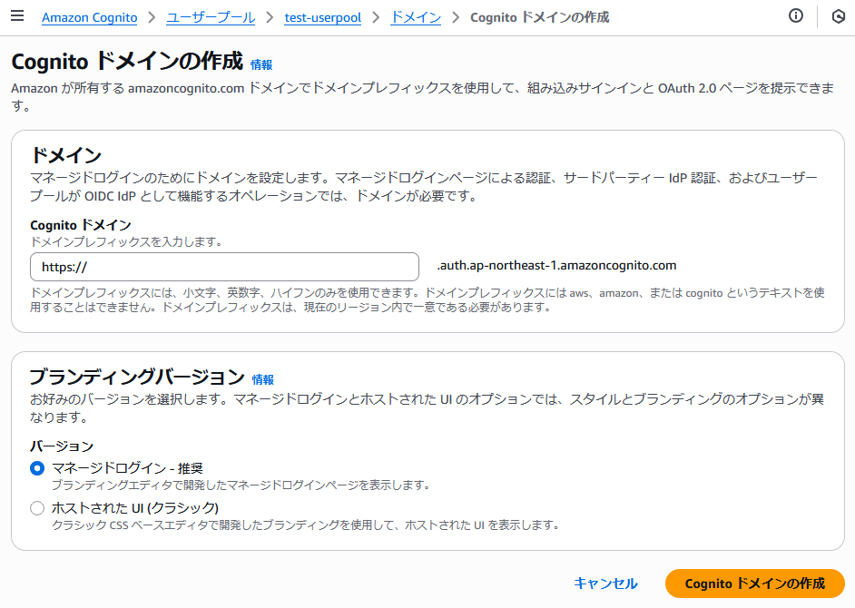

---

以下のようなレスポンスが得られた

```json
{
    "ManagedLoginVersion": 1
}
```

## ここまでの動作確認1

マネジメントコンソール上で確認

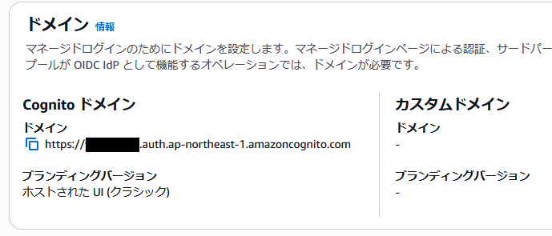

- ブランディングバージョンが「**ホストされた UI (クラシック)**」のドメインとして作成されたことを確認

---

とりあえず作成したドメインの後ろに `/login` のみ付与してアクセスしてみる

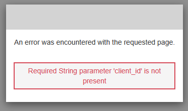

- 必須パラメータのアプリクライアントIDが不足することでエラー画面にリダイレクトすることを確認（期待する結果）

## 既存のアプリクライアントについて Hosted UI が利用可能なよう更新

update-user-pool-client コマンド実行前の様子

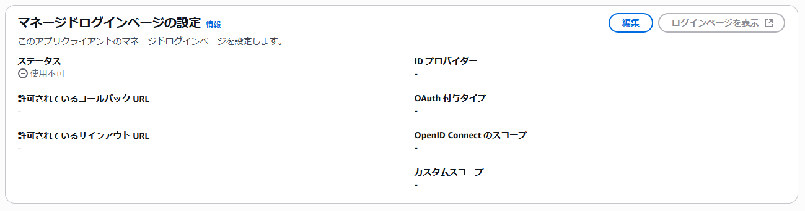

- ステータスが **利用不可** となっていることを確認
- 他の設定項目も全部空白となっていることを確認

---

以下のコマンドで既存のアプリクライアントにマネージドログインページに関する設定を追加する更新を実施

```bash
$ USER_POOL_ID=[ユーザープールID]
$ APP_CLIENT_ID=[アプリクライアントID]

$ aws cognito-idp update-user-pool-client \
  --user-pool-id ${USER_POOL_ID} \
  --client-id ${APP_CLIENT_ID} \
  --supported-identity-providers "COGNITO" \
  --allowed-o-auth-flows-user-pool-client \
  --allowed-o-auth-flows "code" \
  --allowed-o-auth-scopes "openid" "email" "profile" \
  --callback-urls "http://localhost:3000/callback.html" "https://imo-tikuwa.github.io/cognito-demo/callback.html" \
  --logout-urls "http://localhost:3000/" "https://imo-tikuwa.github.io/cognito-demo/"
```

参考：https://docs.aws.amazon.com/cli/latest/reference/cognito-idp/update-user-pool-client.html  
参考：https://dev.classmethod.jp/articles/quickly-create-an-authentication-function-with-amazon-cognito-userpool-with-the-aws-cli/

---

以下のようなレスポンスが得られた

```json
{
    "UserPoolClient": {
        "UserPoolId": "ap-northeast-1_*********",
        "ClientName": "test-userpool-client",
        "ClientId": "**************************",
        "LastModifiedDate": "2025-07-11T09:09:19.680000+00:00",
        "CreationDate": "2025-07-02T03:27:39.867000+00:00",
        "RefreshTokenValidity": 30,
        "TokenValidityUnits": {},
        "SupportedIdentityProviders": [
            "COGNITO"
        ],
        "CallbackURLs": [
            "https://imo-tikuwa.github.io/cognito-demo/callback.html",
            "http://localhost:3000/callback.html"
        ],
        "LogoutURLs": [
            "https://imo-tikuwa.github.io/cognito-demo/",
            "http://localhost:3000/"
        ],
        "AllowedOAuthFlows": [
            "code"
        ],
        "AllowedOAuthScopes": [
            "openid",
            "profile",
            "email"
        ],
        "AllowedOAuthFlowsUserPoolClient": true,
        "EnableTokenRevocation": true,
        "EnablePropagateAdditionalUserContextData": false,
        "AuthSessionValidity": 3
    }
}
```

以下は実行後の様子

## ここまでの動作確認2

マネジメントコンソール上で確認

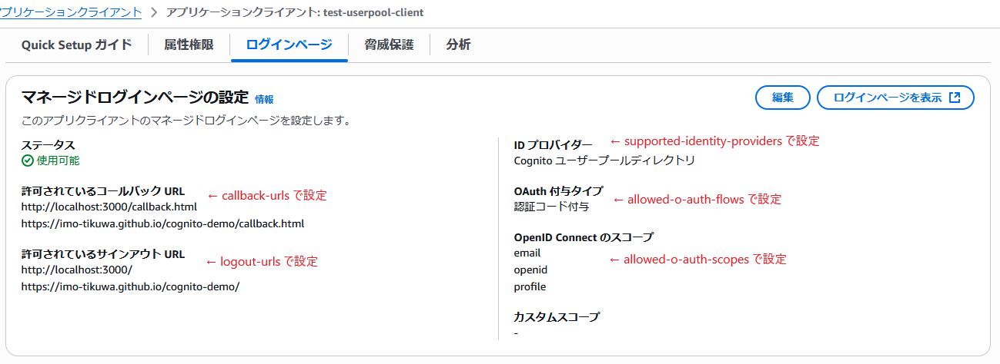

- アプリクライアントの「ログインページ」タブ上でマネージドログインの設定についてステータスが **使用可能** となったことを確認
- 各種設定内容も意図した通りの反映が行えてることを確認

---

以下は「ログインページ」タブ内の **ログインページを表示** を押下した先の画面

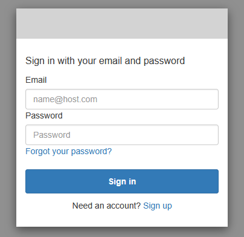

- 認証画面が表示できました
- 認証画面内にパスワードリセット（**Forgot your password?**）の導線とサインアップ（**Sign up**）の導線が表示されていることも確認

また、表示中の Hosted UI の認証画面について以下のような URL となっていました

```
https://[ユーザープールドメイン作成時に入力したプレフィックス].auth.ap-northeast-1.amazoncognito.com/login?client_id=[アプリクライアントID]&response_type=code&scope=email+openid+profile&redirect_uri=http%3A%2F%2Flocalhost%3A3000%2Fcallback.html
```

- `redirect_uri` は複数入力したコールバックURLの先頭の要素がとりあえず（？）設定されている模様

## ユーザーからのサインアップを無効化する

本格的な Hosted UI に遷移する検証ページを開発する前に、ユーザーからのサインアップは今回の検証の中で意図していなかったので以下の手順で無効化しました

```bash
$ aws cognito-idp update-user-pool \
  --user-pool-id ${USER_POOL_ID} \
  --admin-create-user-config AllowAdminCreateUserOnly=true
```

## ここまでの動作確認3

ユーザーからのサインアップを無効化する設定によって Hosted UI の認証画面から **Sign up** のリンクが消えました

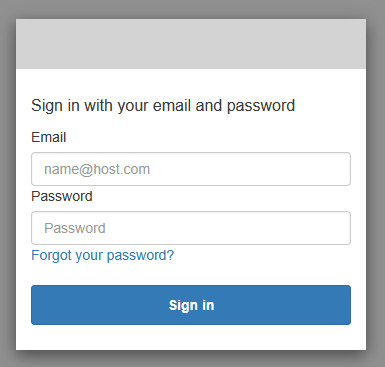

---

サインアップ画面の URL（認証画面の URL の `/login` を `/signup` に置き換え）に直アクセスした場合にもエラー画面に遷移することを確認できました

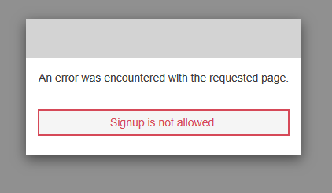

## 2025/7/12 追記 - アプリクライアントの認証フローがリセットされてしまった

[既存のアプリクライアントについて Hosted UI が利用可能なよう更新](#既存のアプリクライアントについて-hosted-ui-が利用可能なよう更新) で実施したアプリクライアントの更新によって認証フローの設定がリセットされてしまった模様？

認証フローの設定について以下のような状態となってしまっていることを確認

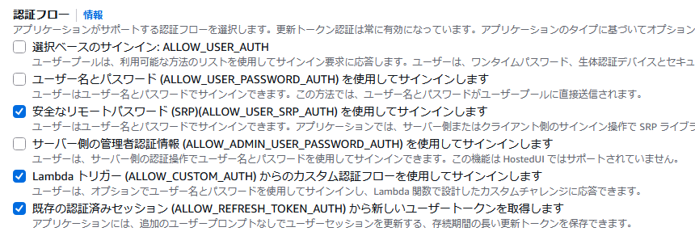

- `ALLOW_USER_SRP_AUTH`、`ALLOW_CUSTOM_AUTH`、`ALLOW_REFRESH_TOKEN_AUTH` の3つの認証フローが選択されている
- 元々は `ALLOW_USER_PASSWORD_AUTH` 認証フローのみを有効化していた状態

---

検証画面からの `USER_PASSWORD_AUTH` を使用した [InitiateAuth](https://docs.aws.amazon.com/AWSJavaScriptSDK/v3/latest/client/cognito-identity-provider/command/InitiateAuthCommand/) コマンドにも失敗することを確認

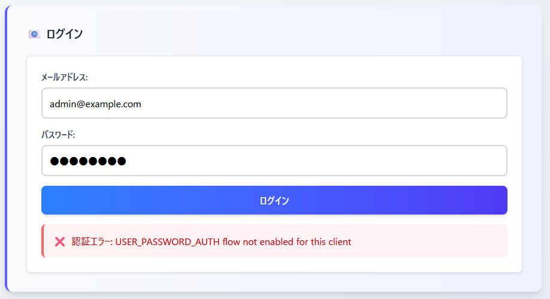

---

`cognito-idp update-user-pool-client` コマンドで更新を掛けたときに認証フローの設定について未指定だったことでリセットされてしまったということと考えられる

そのため以下のように `--explicit-auth-flows` オプションを指定して再度更新を実施

```bash
$ USER_POOL_ID=[ユーザープールID]
$ APP_CLIENT_ID=[アプリクライアントID]

$ aws cognito-idp update-user-pool-client \
  --user-pool-id ${USER_POOL_ID} \
  --client-id ${APP_CLIENT_ID} \
  --supported-identity-providers "COGNITO" \
  --allowed-o-auth-flows-user-pool-client \
  --allowed-o-auth-flows "code" \
  --allowed-o-auth-scopes "openid" "email" "profile" \
  --callback-urls "http://localhost:3000/callback.html" "https://imo-tikuwa.github.io/cognito-demo/callback.html" \
  --logout-urls "http://localhost:3000/" "https://imo-tikuwa.github.io/cognito-demo/" \
  --explicit-auth-flows "ALLOW_USER_PASSWORD_AUTH"
```

---

前回の更新コマンドとのレスポンスの差分は以下の通り

```diff
{
    "UserPoolClient": {
        "UserPoolId": "ap-northeast-1_*********",
        "ClientName": "test-userpool-client",
        "ClientId": "**************************",
-        "LastModifiedDate": "2025-07-11T09:09:19.680000+00:00",
+        "LastModifiedDate": "2025-07-12T02:46:49.748000+00:00",
        "CreationDate": "2025-07-02T03:27:39.867000+00:00",
        "RefreshTokenValidity": 30,
        "TokenValidityUnits": {},
+        "ExplicitAuthFlows": [
+            "ALLOW_USER_PASSWORD_AUTH"
+        ],
        "SupportedIdentityProviders": [
            "COGNITO"
        ],
        "CallbackURLs": [
            "https://imo-tikuwa.github.io/cognito-demo/callback.html",
            "http://localhost:3000/callback.html"
        ],
        "LogoutURLs": [
            "https://imo-tikuwa.github.io/cognito-demo/",
            "http://localhost:3000/"
        ],
        "AllowedOAuthFlows": [
            "code"
        ],
        "AllowedOAuthScopes": [
            "openid",
            "profile",
            "email"
        ],
        "AllowedOAuthFlowsUserPoolClient": true,
        "EnableTokenRevocation": true,
        "EnablePropagateAdditionalUserContextData": false,
        "AuthSessionValidity": 3
    }
}
```

---

画面から見たときの様子も元通りになったことを確認

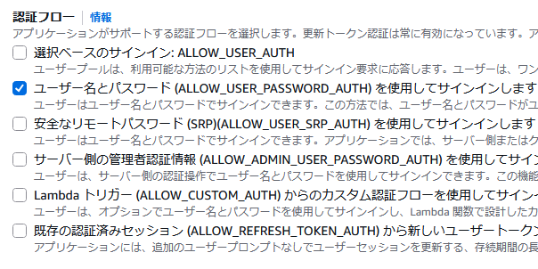

---

検証ページでの動作確認が行えることも確認

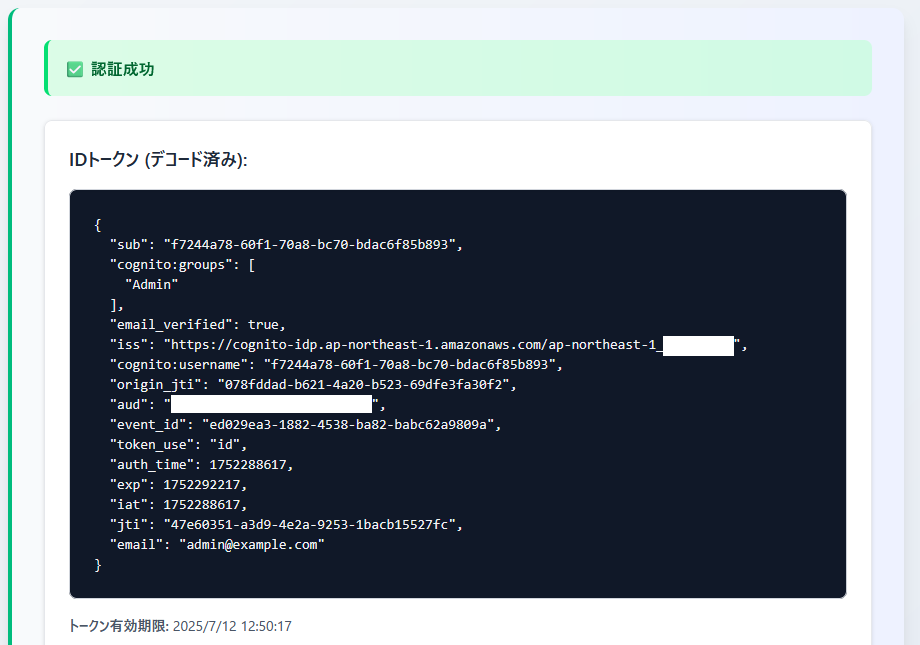
