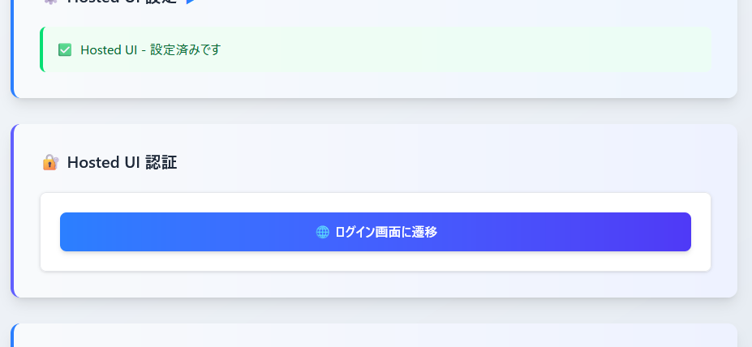

# setup_hosted-ui-login3

setup_hosted-ui-login2.md の続き

Hosted UI を使用した認証に関する一連の動作を確認する

## ここまでの動作確認

### Hosted UI での認証について確認

1. Hosted UI 用の検証ページ（/hosted-ui-verify.html）を開く


2. ユーザープール設定 と Hosted UI 設定についてそれぞれ埋める


3. 両設定の入力を済ませると Hosted UI 認証欄が表示される



- 「ログイン画面に遷移」をクリック

4. Hosted UI の認証ページに遷移できた


- メールアドレスとパスワードを入力して「Sign in」をクリック
- 今回は Admin グループに所属する `admin@example.com` ユーザーで認証する
- **今回は検証しないがパスワードリセットの導線で入力したメールアドレスには実際にパスワードリセット用のメールが飛ぶので検証したい場合はメールアドレスについて自分が保有するアドレスでのアカウント作成を行ったうえで検証を実施すること**

5. `redirect_uri` で指定したコールバック先のページにコード付きで戻ってこれたことを確認


- 開発者ツールを開いた状態で確認
  1. 認証に成功してコールバック先 URL に 302 リダイレクト
  2. コード付きの GET リクエストで自分のコールバック処理用の検証ページ（/callback.html）を表示
  3. コールバック処理用の検証ページ内の処理としてコードをトークンに交換する `/oauth2/token` エンドポイントに fetch によるリクエストを実施。応答として以下のような構造の json を受け取れることを確認

```json
{
	"id_token": "*****",
	"access_token": "*****",
	"refresh_token": "*****",
	"expires_in": 3600,
	"token_type": "Bearer"
}
```

6. 認証とIDトークンの中身を確認する検証ページ（/auth-and-token-verify.html）でデコードされた ID トークンの情報を確認


- `at_hash` というこれまでの検証ページから認証したときの認証結果には含まれていなかった情報が付与されてることを確認
- Admin グループに所属する `admin@example.com` ユーザーの ID トークンとして妥当と思われる情報であることを確認

### 認証中に再度 Hosted UI の認証に遷移する

1. 認証中の状態で、再度 Hosted UI の認証を検証するページで「ログイン画面に遷移」をクリック


↓


- 認証が済んでることが Hosted UI 側でも検知できており、そのままコールバックの URL にコード付きで戻ってこれることを確認

### ID プールを介した一時クレデンシャルの取得について確認

1. 検証ページ（/federated-identity2.html）で「クレデンシャルを検証」をクリック


- 特に問題なく取得できることを確認

2. 「クリップボードに～～～」をクリックしてコピーしたテキストを CloudShell で実行


- Admin グループに所属するユーザーのクレデンシャルとして妥当な成果（**S3のバケット一覧の取得ができること**）を得られたことを確認
