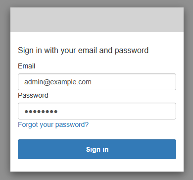
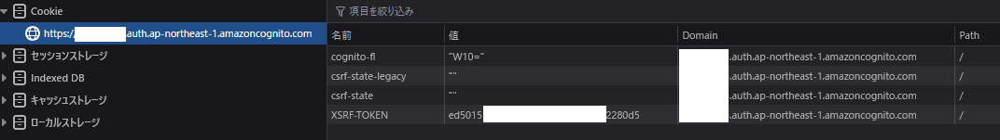
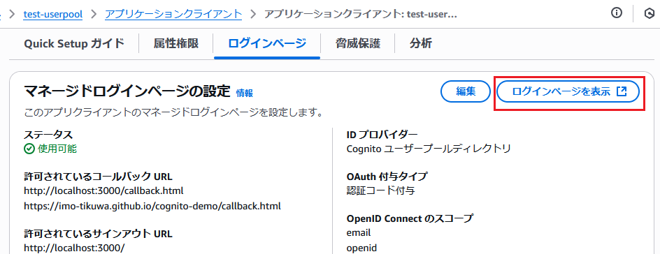

# setup_hosted-ui-login4

setup_hosted-ui-login3.md の続き

前回の検証にて Hosted UI を使用した認証が行えることは確認できた。

ただし、ログアウトについて自作の認証ページ（/auth-and-token-verify.html）からの GlobalSignOutCommand を使用したサインアウトは使えないことが判明するなど、ログアウト周りの検証が不足していることがわかった。

そのため新規で Hosted UI のログアウトエンドポイントに遷移してのログアウトについての検証を行うページ（/hosted-ui-signout.html）を作成したのでそちらを利用した Hosted UI からのサインアウトに関する検証を実施する

## 動作確認

### 開発者ツールについて

**今回一連の動作確認には FireFox を使用している（他のブラウザでもOK）**

事前に開発者ツールを開いておき、永続ログのチェックを入れておく

### Hosted UI で認証

Hosted UI からのサインアウトを検証するにあたってまずは前回同様 Hosted UI での認証を実施する

1. Hosted UI の認証ページを開く

- ユーザープール情報と Hosted UI 設定については埋めている状態

2. 「ログイン画面に遷移」をクリックして Hosted UI の認証画面に遷移

- メールアドレス / パスワード を入力

- 開発者ツール上で Cookie について4つの値が管理されてることを確認

3. Hosted UI 上の「Sign In」をクリックしてコールバック先への遷移（認証が完了すること）を確認

- コードを元にした各種トークン情報の交換に成功し、セッションストレージに認証情報が保存されてることを確認

4. アプリクライアントのログインページタブに表示される「ログインページを表示」をクリックして Hosted UI の認証画面に遷移

↓

- Hosted UI 上でサインイン済みとなっていることを確認

- 開発者ツール上で Cookie について5つの値が管理されてることを確認
  - 認証前には存在しなかった `cognito` というキーの Cookie が追加されていることを確認

5. 認証の検証ページ（/auth-and-token-verify.html）の画面でIDトークンのデコードした情報が閲覧できることを確認

### Hosted UI からサインアウト

1. 今回新設した Hosted UI からのサインアウトを検証するページ（/hosted-ui-signout.html）にアクセス

- 動作確認にはユーザープール（アプリクライアントID）の情報と、Hosted UI のログアウトエンドポイントとなるドメイン情報が必要

2. 「Hosted UI を使用して認証したときのサインアウト」をクリックしてサインアウトURLに戻ってこれることを確認

↓

---

このときのログアウトエンドポイントへのリクエストのレスポンス情報が以下

- サーバーからの応答ヘッダーとして `cookie` と `XSRF-TOKEN` という名前の Cookie について有効期限を 1970年1月1日に設定する Set-Cookie を行っていることを確認

### Hosted UI からのサインアウト後、再度 Hosted UI の認証画面が開けるかを確認

↓

- Hosted UI 上のサインアウトについて正しく行えているため認証画面が開けることを確認