# setup_lambda-trigger

- ユーザープールの Lambda トリガーという拡張機能について検証する
- ユーザープールを使用する中で発生するイベント（サインアップ、認証、カスタム認証、メッセージング等）にフックする形で Lambda 関数を呼べるというもの
  - トリガーとして呼ぶ Lambda 関数側の処理次第で元のイベントをキャンセル（中止？）するといったことも可能みたい
  - 割り当て先となる Lambda 関数の ARN を設定することで有効化するため、Lambda 関数を事前に作成しておく必要がある
- 今回は **`認証後イベントで DynamoDB テーブルにログイン履歴を記録する`** といった使い方をしてみる

---

マネジメントコンソール上からは「認証 > 拡張機能」というページで管理できる

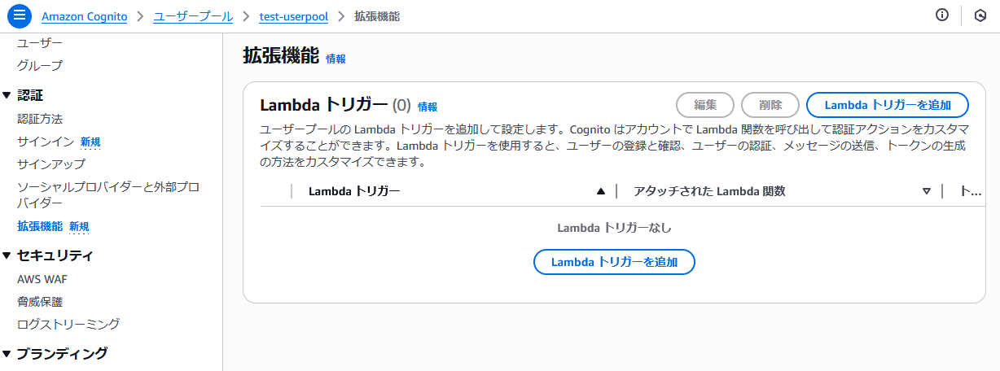


## Lambda トリガーについて

Lambda トリガーを追加する画面に書いてある情報によると最大10種類の Lambda トリガーを使用できる模様

---

以下は **トリガータイプ: サインアップ** のトリガー3つ

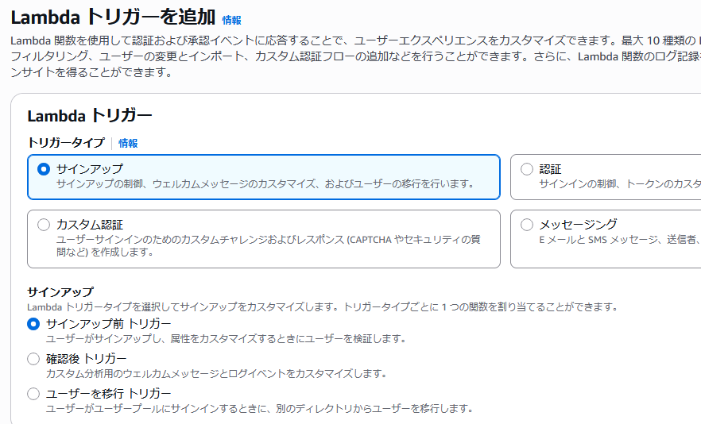

以下は **トリガータイプ: 認証** のトリガー3つ

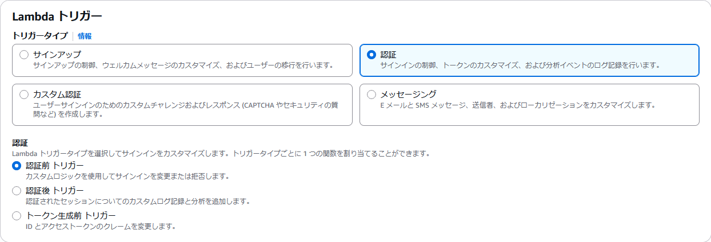

以下は **トリガータイプ: カスタム認証** のトリガー3つ

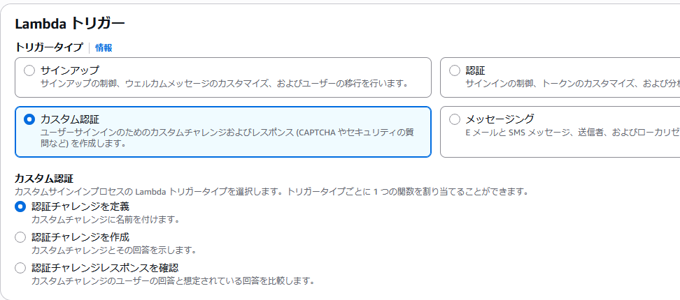

以下は **トリガータイプ: メッセージング** のトリガー1つ

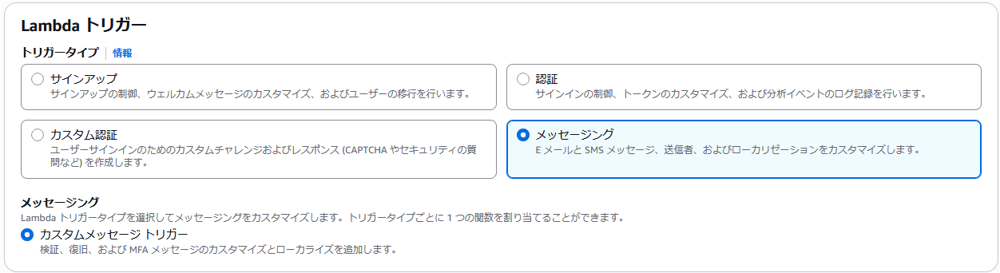

---

同画面の下部に割り当てる Lambda 関数を指定するプルダウンが存在する

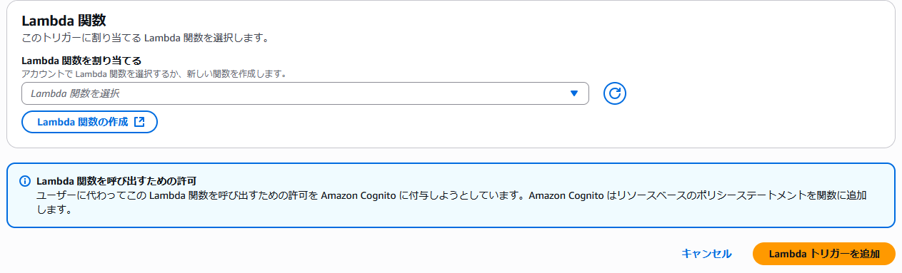

> **Lambda 関数を呼び出すための許可**  
> ユーザーに代わってこの Lambda 関数を呼び出すための許可を Amazon Cognito に付与しようとしています。Amazon Cognito はリソースベースのポリシーステートメントを関数に追加します。

↑ は具体的には Lambda 関数側の「設定 > アクセス権限 > リソースベースのポリシーステートメント」のこと

## Lambda 関数を作成

まずは Lambda トリガーに割り当てる Lambda 関数を開発する

- 開発には AWS SAM を使用する
- ランタイムは Node.js 22.x とする
- Lambda 関数の中でアクセスする DynamoDB テーブルも併せて作成する
- DynamoDB の操作には [@aws-sdk/lib-dynamodb](https://www.npmjs.com/package/@aws-sdk/lib-dynamodb) パッケージを使用する
  - [@aws-sdk/client-dynamodb](https://www.npmjs.com/package/@aws-sdk/client-dynamodb) を使った場合と比べて属性について DynamoDB 独自の形式を意識せずに書けて便利
  - TypeScript のコードについて esbuild を使用したビルドを行うのでこのパッケージは `dependencies` 側に入れておく必要がある
- Lambda トリガーについて仮に画面から追加する場合 `Lambda 関数側に、Cognito からの実行を許可するリソースポリシーが追加される`
  - これは CloudFormation テンプレートの `AWS::Lambda::Permission` リソースによって設定可能。今回はこのリソースも SAM アプリケーション内に含める形とする

<details>
<summary>SAM CLI をインストール</summary>

SAM CLI をインストールしてない場合は以下からインストール（今回は Windows 版を使用）

https://docs.aws.amazon.com/ja_jp/serverless-application-model/latest/developerguide/install-sam-cli.html

---

ダウンロードしたインストーラを実行

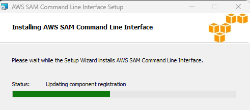

↓

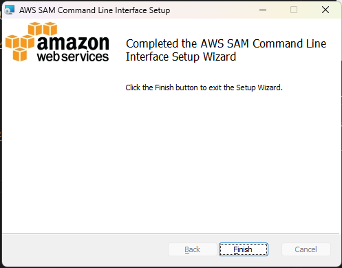

---

インストールできたことを確認

```bash
> which sam
C:\Program Files\Amazon\AWSSAMCLI\bin\sam.CMD

> sam --version
SAM CLI, version 1.142.1
```

</details>

---

なおホストPCには Node.js がインストールされている状態

```bash
> which node
C:\Program Files\nodejs\node.EXE

> node -v
v22.16.0

> npm -v
10.9.2
```

### SAM プロジェクト作成

1. 以下のようなコマンドでプロジェクト作成

```bash
> sam init

You can preselect a particular runtime or package type when using the `sam init` experience.
Call `sam init --help` to learn more.

Which template source would you like to use?
        1 - AWS Quick Start Templates
        2 - Custom Template Location
Choice: 1

Choose an AWS Quick Start application template
        1 - Hello World Example
        2 - Data processing
        3 - Hello World Example with Powertools for AWS Lambda
        4 - Multi-step workflow
        5 - Scheduled task
        6 - Standalone function
        7 - Serverless API
        8 - Infrastructure event management
        9 - Lambda Response Streaming
        10 - GraphQLApi Hello World Example
        11 - Full Stack
        12 - Lambda EFS example
        13 - Serverless Connector Hello World Example
        14 - Multi-step workflow with Connectors
        15 - DynamoDB Example
        16 - Machine Learning
Template: 1

Use the most popular runtime and package type? (python3.13 and zip) [y/N]: N

Which runtime would you like to use?
        1 - dotnet8
        2 - dotnet6
        3 - go (provided.al2)
        4 - go (provided.al2023)
        5 - graalvm.java11 (provided.al2)
        6 - graalvm.java17 (provided.al2)
        7 - java21
        8 - java17
        9 - java11
        10 - java8.al2
        11 - nodejs22.x
        12 - nodejs20.x
        13 - nodejs18.x
        14 - python3.9
        15 - python3.13
        16 - python3.12
        17 - python3.11
        18 - python3.10
        19 - ruby3.4
        20 - ruby3.3
        21 - ruby3.2
        22 - rust (provided.al2)
        23 - rust (provided.al2023)
Runtime: 11

What package type would you like to use?
        1 - Zip
        2 - Image
Package type: 1

Based on your selections, the only dependency manager available is npm.
We will proceed copying the template using npm.

Select your starter template
        1 - Hello World Example
        2 - Hello World Example TypeScript
Template: 2

Would you like to enable X-Ray tracing on the function(s) in your application?  [y/N]: N

Would you like to enable monitoring using CloudWatch Application Insights?
For more info, please view https://docs.aws.amazon.com/AmazonCloudWatch/latest/monitoring/cloudwatch-application-insights.html [y/N]: N

Would you like to set Structured Logging in JSON format on your Lambda functions?  [y/N]: N

Project name [sam-app]: cognito-demo-triggers

    -----------------------
    Generating application:
    -----------------------
    Name: cognito-demo-triggers
    Runtime: nodejs22.x
    Architectures: x86_64
    Dependency Manager: npm
    Application Template: hello-world-typescript
    Output Directory: .
    Configuration file: cognito-demo-triggers\samconfig.toml

    Next steps can be found in the README file at cognito-demo-triggers\README.md


Commands you can use next
=========================
[*] Create pipeline: cd cognito-demo-triggers && sam pipeline init --bootstrap
[*] Validate SAM template: cd cognito-demo-triggers && sam validate
[*] Test Function in the Cloud: cd cognito-demo-triggers && sam sync --stack-name {stack-name} --watch
```

2. まずはそのまま動作確認

```bash
> cd cognito-demo-triggers
> sam build
> sam local invoke HelloWorldFunction
No current session found, using default AWS::AccountId
Invoking app.lambdaHandler (nodejs22.x)
Local image is up-to-date
Using local image: public.ecr.aws/lambda/nodejs:22-rapid-x86_64.

Mounting C:\**********\cognito-demo\cognito-demo-triggers\.aws-sam\build\HelloWorldFunction as /var/task:ro,delegated, inside runtime container
START RequestId: 81236d09-656e-490a-946e-984267f43ebc Version: $LATEST
END RequestId: a99a9752-b481-412d-abde-5163f6b2a5d5
REPORT RequestId: a99a9752-b481-412d-abde-5163f6b2a5d5  Init Duration: 0.04 ms  Duration: 74.03 ms      Billed Duration: 75 ms  Memory Size: 128 MB     Max Memory Used: 128 MB
{"statusCode": 200, "body": "{\"message\":\"hello world\"}"}
[ERROR] [1752714578234] LAMBDA_RUNTIME Failed to get next invocation. No Response from endpoint
```

- Hello World Example テンプレートに含まれる hello-world\app.ts の lambdaHandler 関数が呼び出せてることを確認できました

このときの SAM プロジェクトのコードは以下のコミットで確認可

https://github.com/imo-tikuwa/cognito-demo/tree/b418bafef40936abbf13301b13f8bfa8db0a6f19/cognito-demo-triggers

### 認証後のイベントにトリガーする形に Lambda 関数を作り替える

主に以下のような作業を実施

- `hello-world` フォルダについて認証後のフックの関数としてわかりやすい名称（`authenticated`）に変更
- `authenticated` フォルダ内で `npm install`
- jest に関するコードとパッケージを削除
- SAM プロジェクト直下の events フォルダを削除
- Lambda 関数について Cognito からの実行（Invoke）を許可するリソースポリシー（`AWS::Lambda::Permission`）を追加
- template.yaml の中に DynamoDB テーブルを作成する CloudFormation テンプレートを追記

など

このときの SAM プロジェクトのコードは以下のコミットで確認可

https://github.com/imo-tikuwa/cognito-demo/tree/8c26f9f922a2f4b770be047bcb44326a0917cfc2/cognito-demo-triggers

## SAM App をデプロイ

### 同リポジトリ内のデプロイに必要なリソースを tar.gz 圧縮

**`⚠️ コマンドプロンプトの tar はうまく使えなかったのでここだけ Git Bash を使用しました。。`**

```bash
$ tar zcvf cognito-demo-triggers.tar.gz \
  --exclude=cognito-demo-triggers/.aws-sam \
  --exclude=cognito-demo-triggers/authenticated/node_modules \
  cognito-demo-triggers/
```

### 作成した cognito-demo-triggers.tar.gz を CloudShell にアップロード

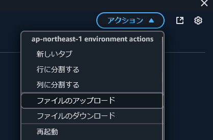

↓

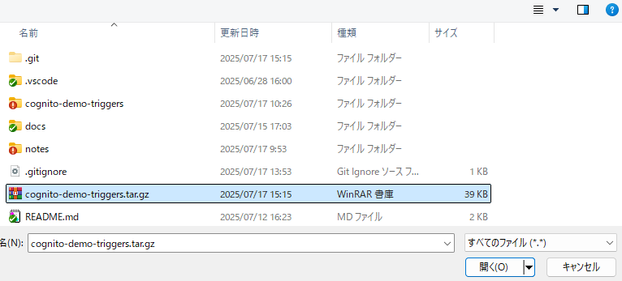

↓

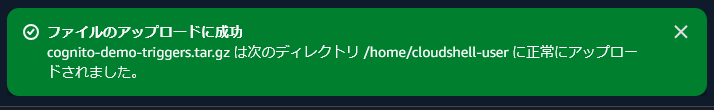

### CloudShell 上からデプロイ

```bash
$ tar zxf cognito-demo-triggers.tar.gz
$ cd cognito-demo-triggers/

$ sam validate
/home/cloudshell-user/cognito-demo-triggers/template.yaml is a valid SAM Template
```

- `sam validate` を実行して妥当なテンプレートであることを確認

```bash
$ sam build

~~~ 省略 ~~~

Build Succeeded

Built Artifacts  : .aws-sam/build
Built Template   : .aws-sam/build/template.yaml

Commands you can use next
=========================
[*] Validate SAM template: sam validate
[*] Invoke Function: sam local invoke
[*] Test Function in the Cloud: sam sync --stack-name {{stack-name}} --watch
[*] Deploy: sam deploy --guided
```

- `sam build` 実行

```bash
$ sam deploy --guided

Configuring SAM deploy
======================

        Looking for config file [samconfig.toml] :  Found
        Reading default arguments  :  Success

        Setting default arguments for 'sam deploy'
        =========================================
        Stack Name [cognito-demo-triggers]: 
        AWS Region [ap-northeast-1]: 
        Parameter CognitoUserPoolArn []: arn:aws:cognito-idp:ap-northeast-1:************:userpool/ap-northeast-1_*********
        #Shows you resources changes to be deployed and require a 'Y' to initiate deploy
        Confirm changes before deploy [Y/n]: 
        #SAM needs permission to be able to create roles to connect to the resources in your template
        Allow SAM CLI IAM role creation [Y/n]: 
        #Preserves the state of previously provisioned resources when an operation fails
        Disable rollback [y/N]: 
        Save arguments to configuration file [Y/n]: 
        SAM configuration file [samconfig.toml]: 
        SAM configuration environment [default]: 

        Looking for resources needed for deployment:
        Creating the required resources...
        Successfully created!

~~~ 省略 ~~~

Previewing CloudFormation changeset before deployment
======================================================
Deploy this changeset? [y/N]: y

2025-07-17 04:07:22 - Waiting for stack create/update to complete

CloudFormation events from stack operations (refresh every 5.0 seconds)

~~~ 省略 ~~~

Successfully created/updated stack - cognito-demo-triggers in ap-northeast-1
```

- `sam deploy` についてガイド付きで実行
- **⚠️ template.yaml の中で `CognitoUserPoolArn` をパラメータ入力する設定としてるためガイドの途中で Cognito ユーザープールの ARN を入力**
- その他は基本的にデフォルトを選択

---

デプロイ後、 Lambda 関数の一覧に `cognito-demo-triggers~~` が作成されてることを確認

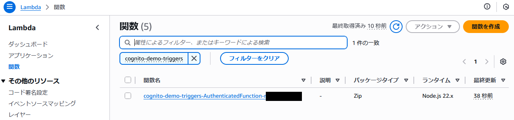

---

作成した Lambda 関数の「設定 > アクセス権限 > リソースベースのポリシーステートメント」を確認

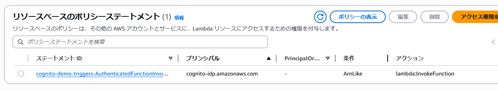

- Lambda 関数に Cognito から実行するためのポリシーが付いていることを確認

---

同リソースベースのポリシーステートメントについて、ステートメント ID をクリックした先のモーダルで、デプロイ時にパラメータ入力したユーザープールの ARN が含まれてることを確認

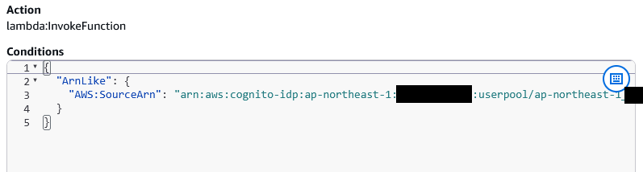

---

その他、自動生成された Lambda の実行ロールについて DynamoDB テーブルに PutItem を行うための権限がついてることを確認

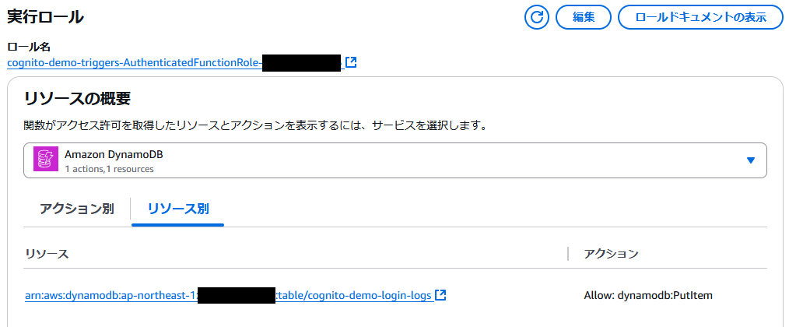

## ユーザープールに Lambda トリガーを作成

**`⚠️ こちら作業の途中にうまく行かなかった手順を含みます。。`**

更新前のユーザープールについて設定を控えておく

```bash
$ USER_POOL_ID=[ユーザープールID]

$ aws cognito-idp describe-user-pool \
  --user-pool-id ${USER_POOL_ID}
```

---

ユーザープールを更新

```bash
$ LAMBDA_ARN=[Lambda トリガーに割り当てたい Lambda 関数のARN]

$ aws cognito-idp update-user-pool \
  --user-pool-id ${USER_POOL_ID} \
  --lambda-config PostAuthentication=${LAMBDA_ARN}
```

- ユーザープールの情報のうち `--lambda-config` で Lambda トリガーに関する設定のみ書き換える
- トリガータイプや指定方法は以下のドキュメント参照（今回は **認証後** なので `PostAuthentication`）

参考：https://docs.aws.amazon.com/cli/latest/reference/cognito-idp/update-user-pool.html

---

更新後、再度 `describe-user-pool` でユーザープールの情報を取得、更新前のものと比較（**左が更新前、右が更新後**）

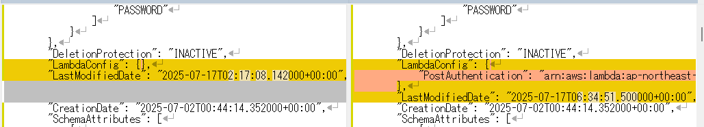

- Lambda トリガーについては意図した設定が行えていることを確認

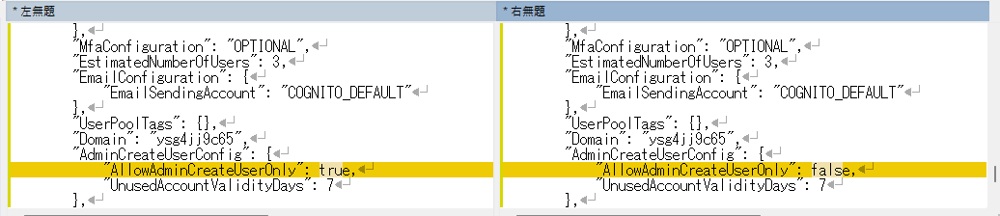

- **`❌ 管理者以外によるサインアップを無効化する設定についてリセットされてしまった模様。。(;o;)`**

---

上記内容を受け、再度更新を実行

```bash
$ aws cognito-idp update-user-pool \
  --user-pool-id ${USER_POOL_ID} \
  --lambda-config PostAuthentication=${LAMBDA_ARN} \
  --admin-create-user-config AllowAdminCreateUserOnly=true
```

- 先ほどの更新コマンドに `--admin-create-user-config` を追加

---

今度は変更前後の差異について Lambda トリガーに関する設定だけになったことを確認

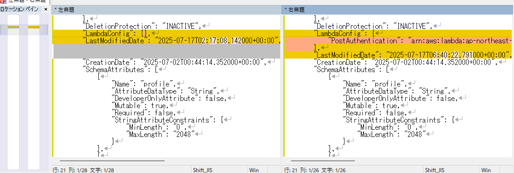

---

ユーザープールの「認証 > 拡張機能」のページにトリガータイプが **認証後** な Lambda トリガーが1件存在することを確認

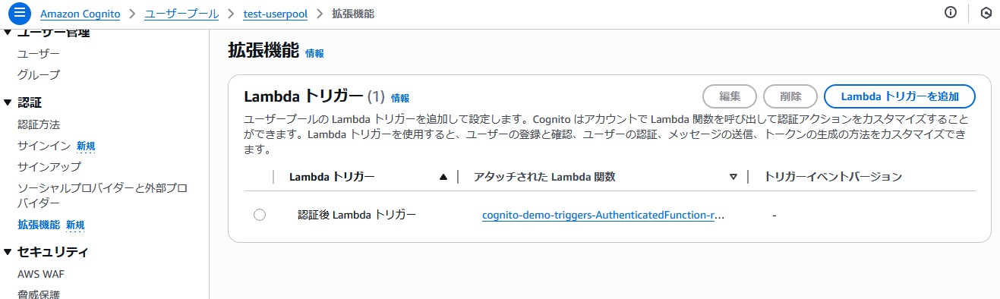

## ここまでの動作確認

### アプリ内から認証

1. 検証ページを開き `admin@example.com` ユーザーで認証

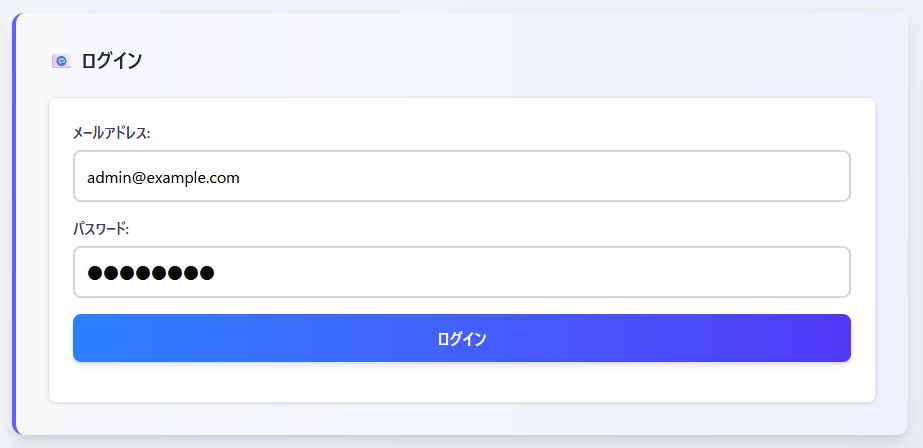

↓

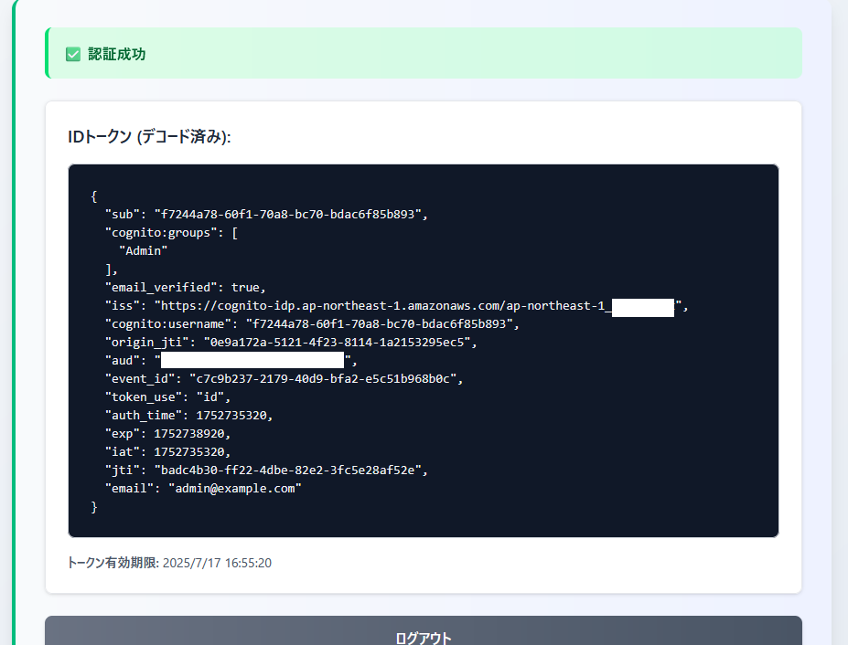

- 認証成功

2. CloudWatch Logs を確認

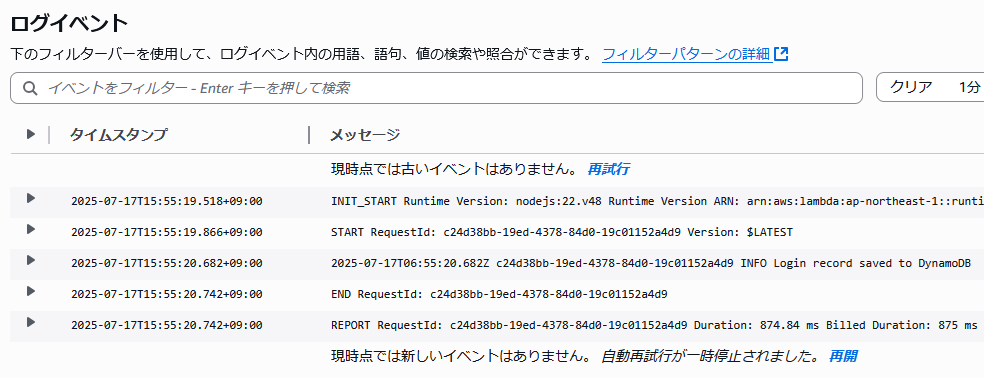

- 1リクエスト分のログが残っていることを確認
- DynamoDB への PutItem API を実行した後のコンソール出力ができてることを確認

3. DynamoDB テーブルを確認

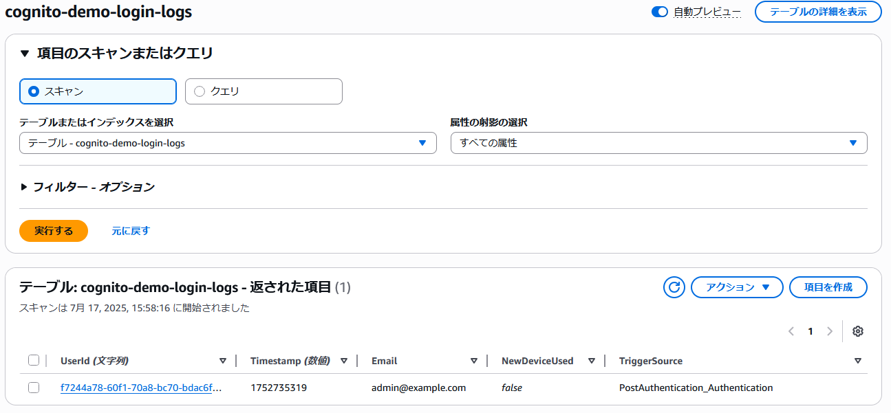

- 1リクエスト分の項目が取得できることを確認

### マネージドログインから認証

1. 検証ページからマネージドログイン画面に遷移し `demo-with-mfa@example.com` ユーザーで認証

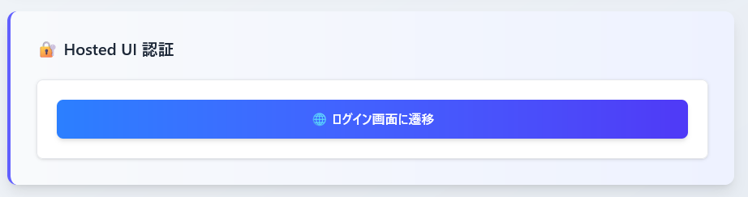

↓

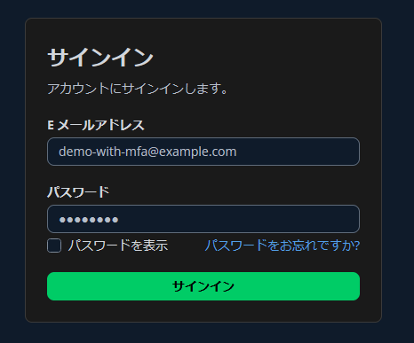

↓

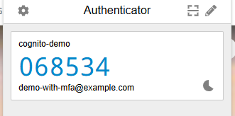

- Authenticator アプリによる MFA が有効化されてるユーザーなので6桁のコードを確認

↓

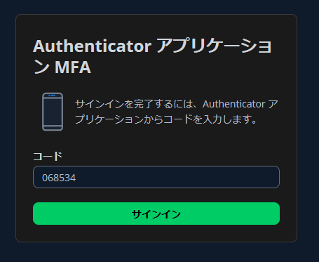

- 1つ前の手順で確認したコードを入力してサインイン

↓

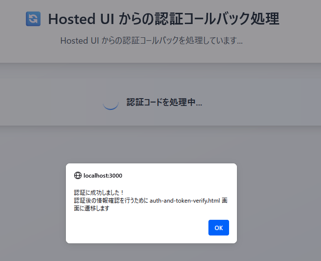

↓

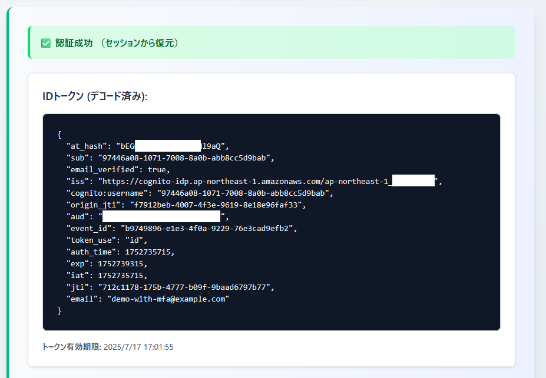

- 認証成功

2. CloudWatch Logs を確認

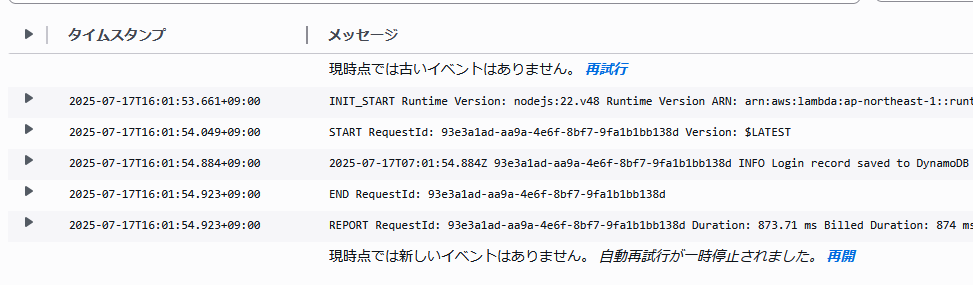

- 1リクエスト分のログが残っていることを確認（`先ほどのアプリからの認証時のログとはログストリームが分かれたので正常`）
- DynamoDB への PutItem API を実行した後のコンソール出力ができてることを確認

3. DynamoDB テーブルを確認

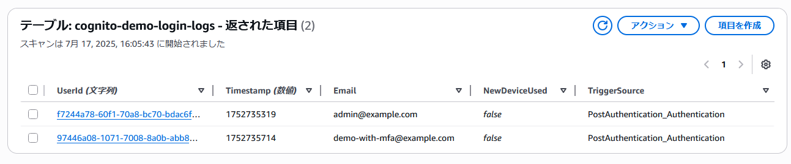

- 先ほどのアプリからの認証のものと合わせて合計2リクエスト分の項目が取得できることを確認

## 備考 - 認証後イベントのペイロードについて

- Lambda トリガーについて **認証後** イベントで Lambda 関数に渡されるイベントペイロードの型は [PostAuthenticationTriggerEvent](https://github.com/DefinitelyTyped/DefinitelyTyped/blob/master/types/aws-lambda/trigger/cognito-user-pool-trigger/post-authentication.d.ts) になる
- **認証後** イベント以外の型も以下にまとまっているので TypeScript (もしくは JSDoc で型補完した記述をするとき) を使う場合は以下を参考にすると良いかも
  - https://github.com/DefinitelyTyped/DefinitelyTyped/tree/master/types/aws-lambda/trigger/cognito-user-pool-trigger

---

ちなみに event の中身について具体的には以下のような構造となっていた

```json
{
    "version": "1",
    "region": "ap-northeast-1",
    "userPoolId": "ap-northeast-1_*********",
    "userName": "97446a08-1071-7008-8a0b-abb8cc5d9bab",
    "callerContext": {
        "awsSdkVersion": "aws-sdk-unknown-unknown",
        "clientId": "**************************"
    },
    "triggerSource": "PostAuthentication_Authentication",
    "request": {
        "userAttributes": {
            "sub": "97446a08-1071-7008-8a0b-abb8cc5d9bab",
            "email_verified": "true",
            "cognito:user_status": "CONFIRMED",
            "email": "demo-with-mfa@example.com"
        },
        "newDeviceUsed": false
    },
    "response": {}
}
```
