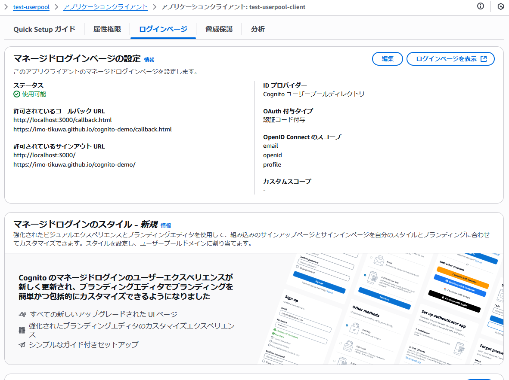
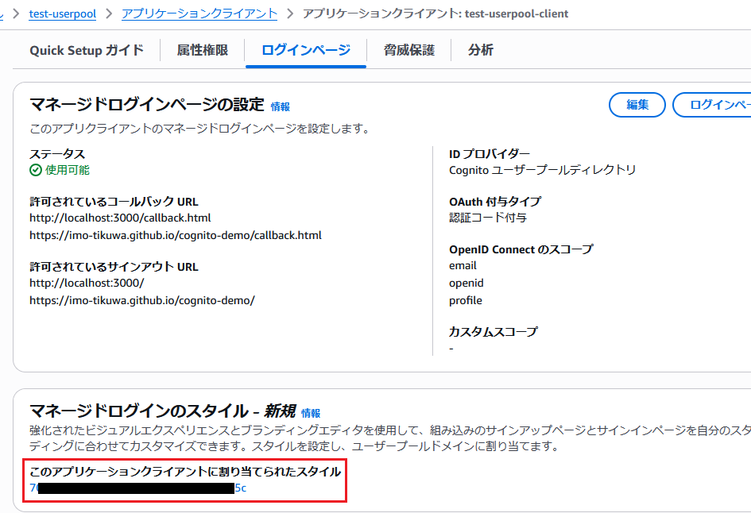

# setup_managed-login

setup_hosted-ui-login.md ～ setup_hosted-ui-login4.md の続き

Hosted UI を使用した認証についてざっくり確認できたので、2025年現在に使用を推奨されているマネージドログインを使用した認証に移行する

## 現状の Hosted UI の認証画面と設定内容について

認証画面


---

マネジメントコンソール上のユーザープールドメインに関する設定内容


---

アプリクライアントの「ログインページ」タブ



## ユーザープールドメインのブランディングバージョンを2に更新

- バージョン 1 が Hosted UI
- バージョン 2 が マネージドログイン

とのこと

```bash
$ USER_POOL_ID=[ユーザープールID]
$ DOMAIN_PREFIX=**********

$ aws cognito-idp update-user-pool-domain \
  --user-pool-id ${USER_POOL_ID} \
  --domain ${DOMAIN_PREFIX} \
  --managed-login-version 2
```

参考：https://docs.aws.amazon.com/cli/latest/reference/cognito-idp/update-user-pool-domain.html

---

以下のようなレスポンスが得られた

```json
{
    "ManagedLoginVersion": 2
}
```

## ここまでの動作確認1

### マネジメントコンソール上の表示を確認


- ユーザープールドメインについてブランディングバージョンを2に更新したことによって **ホストされた UI（クラシック） ⇒ マネージドログイン** に切り替わりました


- 続けてアプリクライアント上の「ログインページ」のタブの表示を確認
- **マネージドログインのスタイル** という欄について表示が少し変わりました。
- **このアプリケーションクライアントに割り当てられたスタイル** 欄は未設定となっている様子

### アプリ上の挙動を確認

Hosted UI の検証ページ（/hosted-ui-verify.html）から Hosted UI の認証画面に遷移


↓


- エラーになってしまいました。。；；

## マネージドログイン画面が表示できない件の調査

調べていくと先ほどのアプリクライアント上で確認した「**このアプリケーションクライアントに割り当てられたスタイル**」が未設定だったことが原因の模様

ユーザープールのサイドバーの「ブランディング > マネージドログイン」の画面からアプリクライアントに紐づけるスタイルと呼ばれるリソースを作成します


aws-cli から作成する場合は以下のドキュメントが参考になりそう

参考：https://docs.aws.amazon.com/cli/latest/reference/cognito-idp/create-managed-login-branding.html

## マネージドログインのスタイルを新規作成＆アプリクライアントにアタッチ

```bash
$ USER_POOL_ID=[ユーザープールID]
$ APP_CLIENT_ID=[アプリクライアントID]

$ aws cognito-idp create-managed-login-branding \
  --user-pool-id ${USER_POOL_ID} \
  --client-id ${APP_CLIENT_ID} \
  --settings '{}'
```

当初 `--user-pool-id` と `--client-id` の2つのみ渡して実行してたのですが以下のようなエラーが返ってきました。

```
An error occurred (InvalidParameterException) when calling the CreateManagedLoginBranding operation: useCognitoProvidedValues or settings should be specified (but not both)
```

- `--use-cognito-provided-values` もしくは `--settings` オプションのどちらかが必須とのこと
- `--use-cognito-provided-values` オプションを入れるとブランディングスタイルについて Amazon Cognito の標準のデザインが設定されるようです。今回はあえて使用せずに `--settings` として空の JSON を設定してみました

---

以下のようなレスポンスを得られました

```json
{
    "ManagedLoginBranding": {
        "ManagedLoginBrandingId": "********-****-****-****-************",
        "UserPoolId": "ap-northeast-1_*********",
        "UseCognitoProvidedValues": false,
        "Settings": {},
        "Assets": [],
        "CreationDate": "2025-07-13T06:18:53.394000+00:00",
        "LastModifiedDate": "2025-07-13T06:18:53.394000+00:00"
    }
}
```

## ここまでの動作確認2

### マネジメントコンソール上の表示を確認


- 「ブランディング > マネージドログイン」の画面で CLI からのコマンドによって作成したスタイルを1件確認



- アプリクライアント上の「ログインページ」のタブで先ほどは空白だった箇所に作成したスタイルの紐づきができてることを確認

### アプリ上の挙動を確認

Hosted UI の検証ページ（/hosted-ui-verify.html）からマネージドログインの認証画面に遷移


↓


- Hosted UI の頃のログイン画面と比べて少しリッチになりました


## マネージドログイン画面を日本語化する

ドキュメントによると `lang` クエリパラメータで表示する言語を切り替えられるとのこと

参考：https://docs.aws.amazon.com/ja_jp/cognito/latest/developerguide/cognito-user-pools-managed-login.html#managed-login-localization

---

アプリ内の認証用のURLを組み立てる関数について `lang=ja` のパラメータを追加

```diff
export function generateAuthURL(config, hostedUIConfig) {
  const currentOrigin = window.location.origin;
  const basePath = window.location.pathname.includes("/cognito-demo/")
    ? "/cognito-demo"
    : "";
  const redirectUri = `${currentOrigin}${basePath}/callback.html`;

  const authUrl = new URL(`${hostedUIConfig.domain}/oauth2/authorize`);
  authUrl.searchParams.set("client_id", config.clientId);
  authUrl.searchParams.set("response_type", "code");
  authUrl.searchParams.set("redirect_uri", redirectUri);
  authUrl.searchParams.set("scope", "openid email profile");
+  authUrl.searchParams.set("lang", "ja");

  return authUrl.toString();
}
```

その後、アプリからマネージドログイン画面に遷移したところ日本語化されたページの表示が行えました


## スタイルのカスタマイズについて

aws-cli 上の操作のみで実施できるか試してみる。まず、現状の設定を確認

```bash
$ USER_POOL_ID=[ユーザープールID]
$ MANAGED_LOGIN_BRANDING_ID=[マネージドログインのスタイルID(UUID)]

$ aws cognito-idp describe-managed-login-branding \
  --user-pool-id ${USER_POOL_ID} \
  --managed-login-branding-id ${MANAGED_LOGIN_BRANDING_ID} \
  --return-merged-resources
```

参考：https://docs.aws.amazon.com/cli/latest/reference/cognito-idp/describe-managed-login-branding.html

---

`--return-merged-resources` オプション付きで実行するとレスポンスとして得られる JSON の `ManagedLoginBranding.Settings` と `ManagedLoginBranding.Assets` に Amazon Cognito のデフォルト？のスタイルとマージされた設定を取得できる模様

```bash
$ aws cognito-idp describe-managed-login-branding \
  --user-pool-id ${USER_POOL_ID} \
  --managed-login-branding-id ${MANAGED_LOGIN_BRANDING_ID} \
  --return-merged-resources \
  > managed-login-style.json

$ aws cognito-idp describe-managed-login-branding \
  --user-pool-id ${USER_POOL_ID} \
  --managed-login-branding-id ${MANAGED_LOGIN_BRANDING_ID} \
  --return-merged-resources \
  | jq '.ManagedLoginBranding.Settings' \
  > managed-login-style-settings.json

$ aws cognito-idp describe-managed-login-branding \
  --user-pool-id ${USER_POOL_ID} \
  --managed-login-branding-id ${MANAGED_LOGIN_BRANDING_ID} \
  --return-merged-resources \
  | jq '.ManagedLoginBranding.Assets' \
  > managed-login-style-assets.json

$ ll -S managed-login-style*
-rw-r--r--. 1 cloudshell-user cloudshell-user 123480 Jul 13 07:31 managed-login-style.json
-rw-r--r--. 1 cloudshell-user cloudshell-user 103208 Jul 13 07:32 managed-login-style-assets.json
-rw-r--r--. 1 cloudshell-user cloudshell-user  10208 Jul 13 07:32 managed-login-style-settings.json
```

- 全体で 120 KB ほどある
- Assets だけを抽出したものは SVG の情報が入っているためファイルサイズの原因の大半はこれみたい
- Settings だけを抽出した方も 10 KB ほどのテキストとなっていることを確認

---

以下は Assets 内のデータの一部

```json
[
  {
    "Category": "PAGE_FOOTER_BACKGROUND",
    "ColorMode": "DARK",
    "Extension": "SVG",
    "Bytes": "PHN2ZyB3aWR0aD0iMjAwMDAiIGhlaWdodD0iNDAwIiB2aWV3Qm94PSIwIDAgMjAwMDAgNDAwIiBmaWxsPSJub25lIiB4bWxucz0iaHR0cDovL3d3dy53My5vcmcvMjAwMC9zdmciPgo8ZyBjbGlwLXBhdGg9InVybCgjY2xpcDBfMTcyNTlfMjM2Njc0KSI+CjxyZWN0IHdpZHRoPSIyMDAwMCIgaGVpZ2h0PSI0MDAiIGZpbGw9InVybCgjcGFpbnQwX2xpbmVhcl8xNzI1OV8yMzY2NzQpIi8+CjxwYXRoIGQ9Ik0wIDBIMjAwMDBWNDAwSDBWMFoiIGZpbGw9IiMxMjIwMzciIGZpbGwtb3BhY2l0eT0iMC41Ii8+CjwvZz4KPGRlZnM+CjxsaW5lYXJHcmFkaWVudCBpZD0icGFpbnQwX2xpbmVhcl8xNzI1OV8yMzY2NzQiIHgxPSItODk0LjI0OSIgeTE9IjE5OS45MzEiIHgyPSIxODAzNC41IiB5Mj0iLTU4OTkuNTciIGdyYWRpZW50VW5pdHM9InVzZXJTcGFjZU9uVXNlIj4KPHN0b3Agc3RvcC1jb2xvcj0iI0JGODBGRiIvPgo8c3RvcCBvZmZzZXQ9IjEiIHN0b3AtY29sb3I9IiNGRjhGQUIiLz4KPC9saW5lYXJHcmFkaWVudD4KPGNsaXBQYXRoIGlkPSJjbGlwMF8xNzI1OV8yMzY2NzQiPgo8cmVjdCB3aWR0aD0iMjAwMDAiIGhlaWdodD0iNDAwIiBmaWxsPSJ3aGl0ZSIvPgo8L2NsaXBQYXRoPgo8L2RlZnM+Cjwvc3ZnPgo="
  },
  // 省略
]
```

---

以下はカスタマイズしやすそうな Settings 内のデータの一部（とはいえこちらも450行もある）

```json
{
  "components": {
    "secondaryButton": {
      "lightMode": {
        "hover": {
          "backgroundColor": "f2f8fdff",
          "borderColor": "033160ff",
          "textColor": "033160ff"
        },
        "defaults": {
          "backgroundColor": "ffffffff",
          "borderColor": "0972d3ff",
          "textColor": "0972d3ff"
        },
        "active": {
          "backgroundColor": "d3e7f9ff",
          "borderColor": "033160ff",
          "textColor": "033160ff"
        }
      },
      "darkMode": {
        "hover": {
          "backgroundColor": "192534ff",
          "borderColor": "89bdeeff",
          "textColor": "89bdeeff"
        },
        "defaults": {
          "backgroundColor": "0f1b2aff",
          "borderColor": "539fe5ff",
          "textColor": "539fe5ff"
        },
        "active": {
          "backgroundColor": "354150ff",
          "borderColor": "89bdeeff",
          "textColor": "89bdeeff"
        }
      }
    },
    // 省略
  },
  // 省略
}
```

---

`managed-login-style-settings.json` の一部を書き換えた `customized-managed-login-style.json` を作成

```bash
$ jq '
  .components.pageBackground.image.enabled = false
  | .components.primaryButton.darkMode.defaults.backgroundColor = "00cc66ff"
  | .components.primaryButton.darkMode.defaults.textColor = "000000ff"
  | .components.form.darkMode.backgroundColor = "1a1a1aff"
  | .components.form.darkMode.borderColor = "3a3a3aff"
  | .categories.global.colorSchemeMode = "DARK"
' managed-login-style-settings.json > customized-managed-login-style.json

$ diff managed-login-style-settings.json customized-managed-login-style.json
55,56c55,56
<         "backgroundColor": "0f1b2aff",
<         "borderColor": "424650ff"
---
>         "backgroundColor": "1a1a1aff",
>         "borderColor": "3a3a3aff"
82c82
<         "enabled": true
---
>         "enabled": false
131,132c131,132
<           "backgroundColor": "539fe5ff",
<           "textColor": "000716ff"
---
>           "backgroundColor": "00cc66ff",
>           "textColor": "000000ff"
432c432
<       "colorSchemeMode": "LIGHT",
---
>       "colorSchemeMode": "DARK",
```

- ページの背景画像を無効化
- デフォルトのカラーモードについてライト⇒ダークに変更
- ダークテーマの背景色、テキストカラーを変更

---

jq コマンドを使用して生成した `customized-managed-login-style.json` を入力としてマネージドログインのスタイル設定を更新

```bash
$ aws cognito-idp update-managed-login-branding \
  --user-pool-id ${USER_POOL_ID} \
  --managed-login-branding-id ${MANAGED_LOGIN_BRANDING_ID} \
  --settings file://customized-managed-login-style.json
```

参考：https://docs.aws.amazon.com/cli/latest/reference/cognito-idp/update-managed-login-branding.html

正常に実行できた場合、レスポンスとして得られる内容は `file://customized-managed-login-style.json` で渡した Settings を含む内容なのでかなりの量になるのでこの場では省略

## ここまでの動作確認3

1. 検証ページからマネージドログインの認証画面に遷移


↓


- 変更した内容が反映されてることを確認できました！！！
- AI に `ManagedLoginBranding.Settings` の450行をすべて共有して「〇〇みたいな感じで～～」とか指示したらいい感じにやってくれるかもしれない？
- 言語スイッチ（`categories.form.languageSelector.enabled`）の設定とかは `enabled: false` を `true` に切り替えるだけではこれと言って変化しなかった？みたいなので、画面からやった方が安全かつ早い気がしなくもない？？
