# setup_multi-factor-authentication

ユーザープールを介した認証について MFA（Multi-Factor Authentication）の設定と検証を行う

これまでの手順で作成したユーザープール、Cognito ユーザー、アプリクライアントなどは

- メールアドレス / パスワードの認証フロー（USER_PASSWORD_AUTH）のみを対象としている
- ユーザーは aws-cli のコマンド操作で作成＆検証済みとした **メールアドレスが架空のもの**

といった事情があるため **メール送信** や **電話番号宛ての SMS** は MFA の方法として使用できない。

そのため今回は Google Authenticator などの Authenticator アプリを使用した TOTP（Time-based One-Time Password）のみを唯一の MFA として有効化する方針で検証を行う。

なお MFA の入力を必要とするユーザーは新規に作成し、既存のユーザー（`demo@example.com`, `admin@example.com`）はこれまで通り MFA を使用せずに認証可能な方針とする。

## ユーザープールの MFA 設定

<details>
<summary>画面上の操作を確認</summary>

1. ユーザープールの詳細画面の「認証 > サインイン」のページを開く

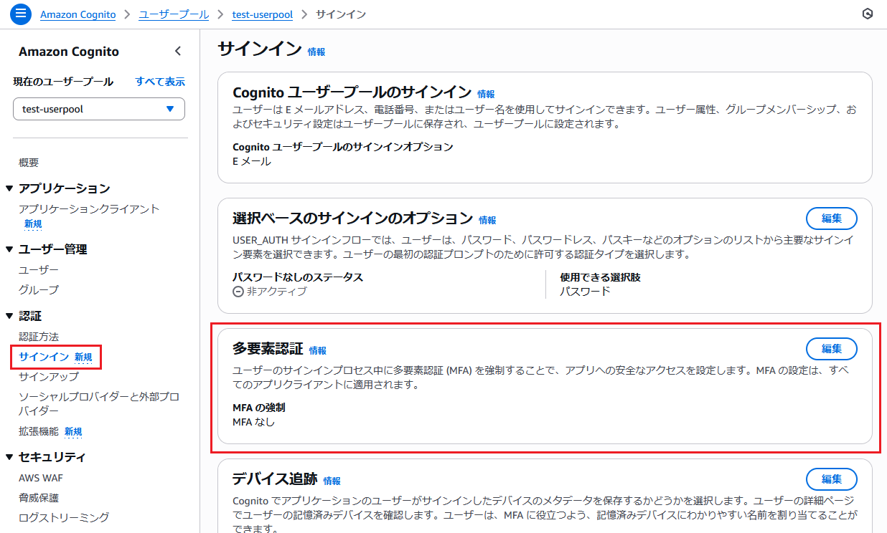

- 「編集」をクリック

2. MFA の設定画面を開く


3. 「**MFA を必須にする - 推奨**」「**オプションの MFA**」のどちらかを選ぶと **MFA の方法** 欄が表示される

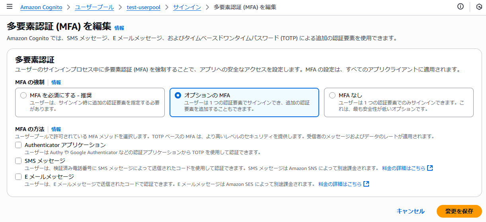

</details>

---

画面からの操作を元に以下のような方針の設定を実施する

- **MFA の強制**： **オプションの MFA** を選択
- **MFA の方法**： **Authenticator アプリケーション** のみを選択

### ユーザープール側の現状の設定を確認

```bash
$ USER_POOL_ID=[ユーザープールID]

$ aws cognito-idp get-user-pool-mfa-config \
  --user-pool-id ${USER_POOL_ID}
```

参考：https://docs.aws.amazon.com/cli/latest/reference/cognito-idp/get-user-pool-mfa-config.html

---

以下のようなレスポンスが得られた

```json
{
    "MfaConfiguration": "OFF"
}
```

- MFA について無効化されていることを確認

### ユーザープール側の MFA を有効化

```bash
$ aws cognito-idp set-user-pool-mfa-config \
  --user-pool-id ${USER_POOL_ID} \
  --software-token-mfa-configuration Enabled=true \
  --mfa-configuration "OPTIONAL"
```

参考：https://docs.aws.amazon.com/cli/latest/reference/cognito-idp/set-user-pool-mfa-config.html

---

以下のようなレスポンスが得られた

```json
{
    "SoftwareTokenMfaConfiguration": {
        "Enabled": true
    },
    "MfaConfiguration": "OPTIONAL"
}
```

## ここまでの動作確認1

既存のユーザー（`admin@example.com`）についてこれまでと変わりなく認証が可能かを検証する

### アプリからの認証

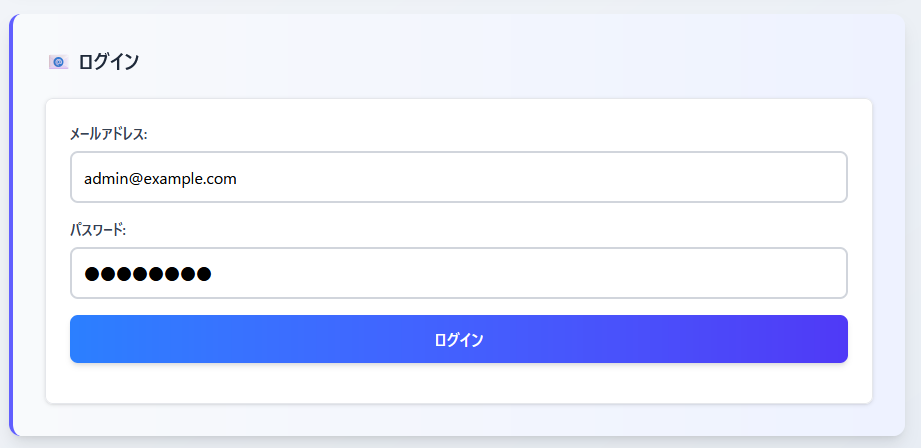

↓

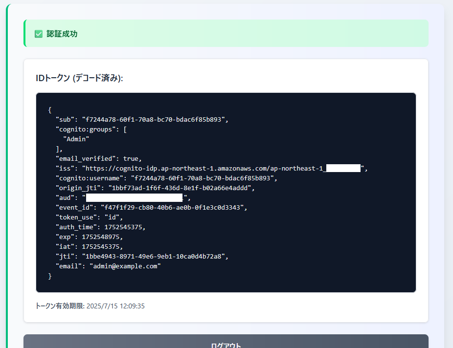

- 認証できることを確認

---

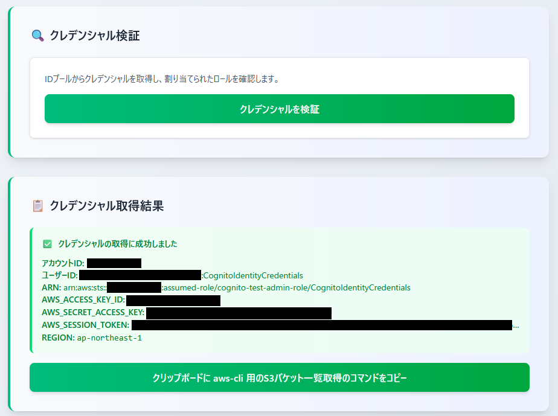

- クレデンシャルの取得もできることを確認

---

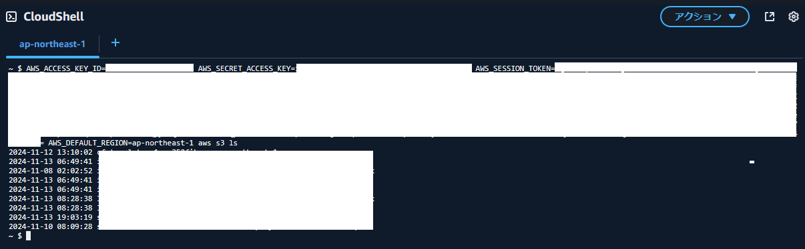

- 取得したクレデンシャルで S3 のバケット一覧が取得できることも確認

---

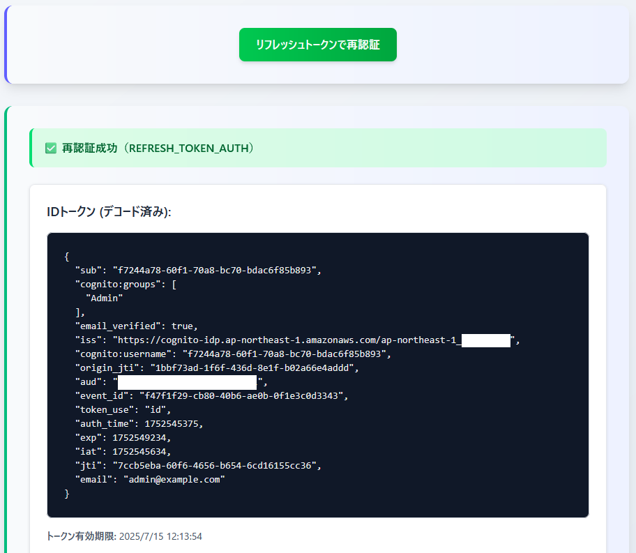

- リフレッシュトークンを使用した再認証も正常に行えることを確認

### マネージドログインからの認証

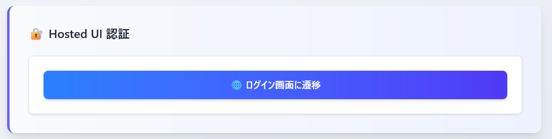

↓

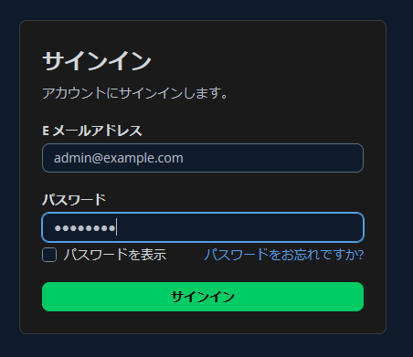

↓

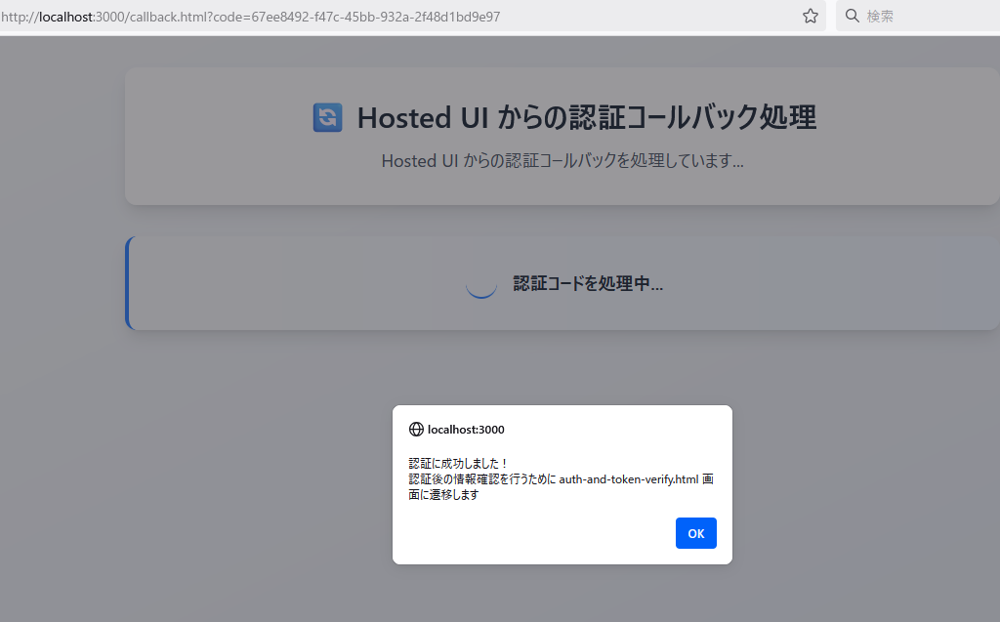

↓

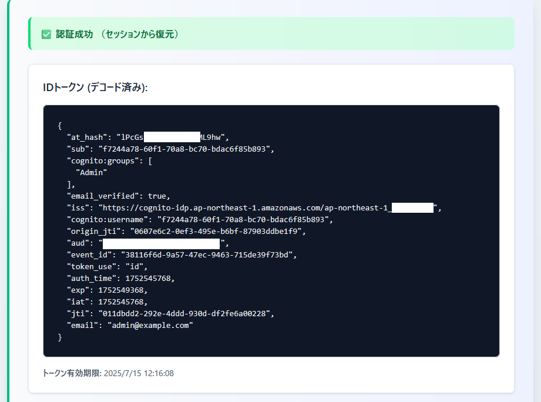

- マネージドログインページに遷移できること
- 正しいメールアドレスとパスワードの組み合わせでログインを行い、コールバック先のURLに戻ってこれること
- コールバック先のURL内でコードを元に各種トークン情報を取得できること

などを確認

## MFA を利用するユーザーを作成&設定

**`※この辺からなかなかうまく行かず試行錯誤しています。失敗した内容も記してるので読みづらいかも。。(;;)`**

### Cognito ユーザーを作成

```bash
$ USER_POOL_ID=[ユーザープールID]
$ USER_EMAIL=demo-with-mfa@example.com

$ aws cognito-idp admin-create-user \
  --user-pool-id ${USER_POOL_ID} \
  --username ${USER_EMAIL} \
  --user-attributes Name=email,Value=${USER_EMAIL} Name=email_verified,Value=true \
  --message-action SUPPRESS
```

---

作成したユーザーについてパスワード設定＆確認ステータスを `確認済み` に更新

```bash
$ USER_PASSWORD=Aaaa1111

$ aws cognito-idp admin-set-user-password \
  --user-pool-id ${USER_POOL_ID} \
  --username ${USER_EMAIL} \
  --password ${USER_PASSWORD} \
  --permanent
```

### aws-cli 上で Cognito ユーザーを認証

後述する Authenticator アプリ用のシークレットを作成するためのコマンド（[associate-software-token](https://docs.aws.amazon.com/cli/latest/reference/cognito-idp/associate-software-token.html)）でアクセストークンが必要となるため aws-cli の [initiate-auth](https://docs.aws.amazon.com/cli/latest/reference/cognito-idp/initiate-auth.html) コマンドで認証する

<details>
<summary>initiate-auth コマンドについて</summary>

[initiate-auth](https://docs.aws.amazon.com/cli/latest/reference/cognito-idp/initiate-auth.html) とは別に [admin-initiate-auth](https://docs.aws.amazon.com/cli/latest/reference/cognito-idp/admin-initiate-auth.html) というコマンドが存在する  
当初こちらを使用して認証を行おうとしていたのだが、以下のようなエラーが出てしまった。

```bash
$ aws cognito-idp admin-initiate-auth \
  --user-pool-id ${USER_POOL_ID} \
  --client-id ${APP_CLIENT_ID} \
  --auth-flow ADMIN_USER_PASSWORD_AUTH \
  --auth-parameters USERNAME=${USER_EMAIL},PASSWORD=${USER_PASSWORD}

An error occurred (InvalidParameterException) when calling the AdminInitiateAuth operation: Auth flow not enabled for this client
```

ここから先は試せていないので推測になるけど、これはアプリクライアント上で `ALLOW_USER_PASSWORD_AUTH` のみ許可するような設定をしていたことが原因の可能性が考えられる  
`ALLOW_ADMIN_USER_PASSWORD_AUTH` という認証フローのチェックが必要（と思われる）

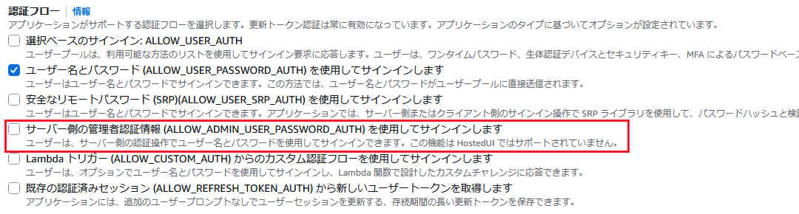

</details>

---

```bash
$ APP_CLIENT_ID=[アプリクライアントID]

$ ACCESS_TOKEN=$(aws cognito-idp initiate-auth \
  --client-id ${APP_CLIENT_ID} \
  --auth-flow USER_PASSWORD_AUTH \
  --auth-parameters USERNAME=${USER_EMAIL},PASSWORD=${USER_PASSWORD} \
  | jq -r '.AuthenticationResult.AccessToken')
```

- 認証結果のアクセストークンを `ACCESS_TOKEN` 変数に格納

### Authenticator アプリ用のシークレット作成＆ Authenticator アプリに登録

アクセストークンを使用して [associate-software-token](https://docs.aws.amazon.com/cli/latest/reference/cognito-idp/associate-software-token.html) コマンド実行

```bash
$ SECRET_CODE=$(aws cognito-idp associate-software-token \
  --access-token ${ACCESS_TOKEN} \
  | jq -r '.SecretCode')
```

- Authenticator アプリに設定を登録するのに必要となるシークレットについて `SECRET_CODE` 変数に格納

---

[Authenticator](https://chromewebstore.google.com/detail/authenticator/bhghoamapcdpbohphigoooaddinpkbai?hl=ja) アプリでインポート可能な otpauth URI スキーム形式の文字列を出力する

```bash
$ echo "otpauth://totp/${USER_EMAIL}?secret=${SECRET_CODE}&issuer=cognito-demo"
otpauth://totp/demo-with-mfa@example.com?secret=3Y**************************************************&issuer=cognito-demo
```

- `issuer` はアプリ登録後の見出しとして設定されるので任意の値を設定可能（今回はリポジトリ名にちなんだ cognito-demo を設定）

---

以下のような手順で [Authenticator](https://chromewebstore.google.com/detail/authenticator/bhghoamapcdpbohphigoooaddinpkbai?hl=ja) アプリに登録

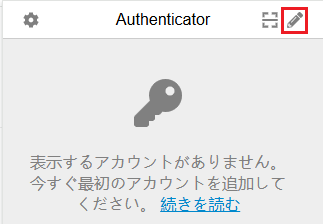

↓


↓

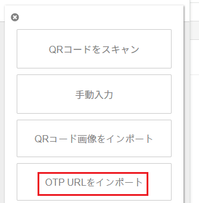

↓

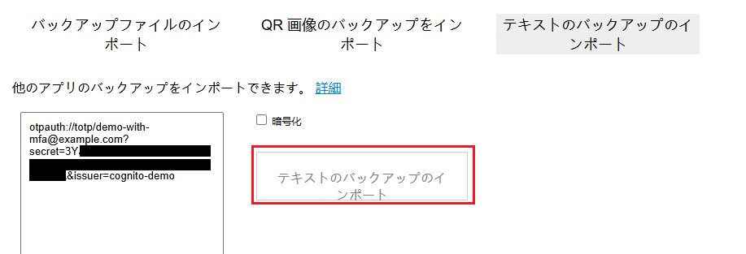

- テキストエリアに otpauth URI スキームのテキストをペースト

↓

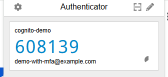

- 登録できました

### Authenticator アプリのコードを使用した検証

**`🚨この検証を済ませないと「シークレット作成 ⇒ Authenticator アプリ登録」の一連のプロセスについて完全に完了したとは言えず、後続のアプリ内やマネージドログインからの認証を検証する時に6桁のコードを入力するような導線にならないので注意`** ⇐ 2時間くらい嵌った(;;)

[verify-software-token](https://docs.aws.amazon.com/cli/latest/reference/cognito-idp/verify-software-token.html) コマンドを使用して **アクセストークン + 6桁のコード** の検証を行う

```bash
$ aws cognito-idp verify-software-token \
  --access-token ${ACCESS_TOKEN} \
  --user-code [Authenticator アプリに表示される6桁のコード]
```

以下のようなレスポンスが得られれば OK

```json
{
    "Status": "SUCCESS"
}
```

### ユーザー側の MFA 設定をアクティブ化

認証時に MFA の利用を必要とするユーザーについて MFA（TOTP）の利用と優先に関する設定変更を実施する

以下は設定変更前のユーザー詳細


- MFA の設定が **非アクティブ** となっていることを確認

---

こちらは admin-set-user-mfa-preference コマンドで設定を変更できることを確認

参考：https://docs.aws.amazon.com/cli/latest/reference/cognito-idp/admin-set-user-mfa-preference.html

```bash
$ aws cognito-idp admin-set-user-mfa-preference \
  --user-pool-id ${USER_POOL_ID} \
  --username ${USER_EMAIL} \
  --software-token-mfa-settings Enabled=true,PreferredMfa=true
```

<details>
<summary>set-user-mfa-preference コマンドの場合</summary>

今回は admin-set-user-mfa-preference コマンドで変更したが、前の手順でアクセストークンを取得しているため以下のコマンドでも設定できる（と思われる）

参考：https://docs.aws.amazon.com/cli/latest/reference/cognito-idp/set-user-mfa-preference.html

```bash
$ aws cognito-idp set-user-mfa-preference \
  --access-token ${ACCESS_TOKEN} \
  --software-token-mfa-settings Enabled=true,PreferredMfa=true
```

</details>

---

コマンド実行後以下のように切り替わることを確認

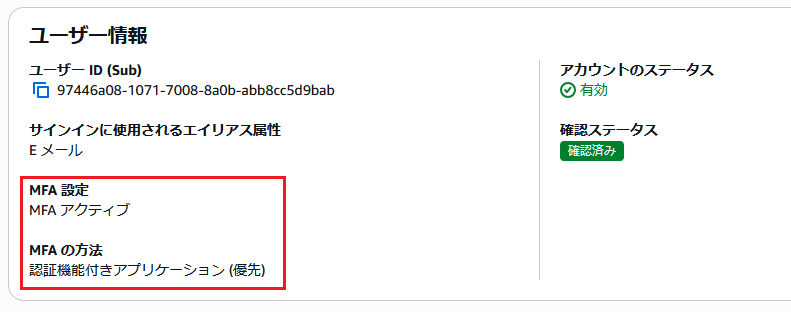

- **※注意する点として、このコマンドは [associate-software-token](https://docs.aws.amazon.com/cli/latest/reference/cognito-idp/associate-software-token.html) のシークレット生成の後で実施する必要がある**
- associate-software-token コマンドを実行する前に実施したところ以下のようなエラーが出た

```
An error occurred (InvalidParameterException) when calling the AdminSetUserMFAPreference operation: User does not have delivery config set to turn on SOFTWARE_TOKEN_MFA
```

- `SOFTWARE_TOKEN_MFA`（「associate-software-token で生成するシークレットコードについてユーザーが保持してないよ」という感じのエラーかなと思われる）

## アプリの認証処理を修正

既存の状態では MFA のチャレンジに対応できていないため認証の検証ページ（/auth-and-token-verify.html）を修正する

InitiateAuth コマンドのレスポンスについて MFA のチャレンジが必要な場合に認証情報を含まず、追加のチャレンジに関するレスポンスが返ってくるようになる  
具体的には以下のようなレスポンス

```json
{
	"ChallengeName": "SOFTWARE_TOKEN_MFA",
	"ChallengeParameters": {
		"USER_ID_FOR_SRP": "********-****-****-****-************"
	},
	"Session": "*********"
}
```

- 今回の検証の中では Authenticator アプリでの MFA のみに対応してるがユーザーごとに異なる MFA の設定をしてる場合は InitiateAuth コマンドの ChallengeName の値を元に分岐するのがよさそう
- `ChallengeParameters` 内に `USER_ID_FOR_SRP` という情報が含まれてますがこれはおそらく `USER_SRP_AUTH` 認証フローを使用した場合の RespondToAuthChallenge API リクエストに含める必要があるパラメータと思われる。今回の `USER_PASSWORD_AUTH` 認証フローでは設定せずに動作することを確認

---

アプリ内の認証処理について修正前とのコードとの差分は以下のような感じ（**※抜粋、詳細は auth-and-token-verify.html を参照**）

```diff
<script type="module">
import {
  CognitoIdentityProviderClient,
  InitiateAuthCommand,
  GlobalSignOutCommand,
+  RespondToAuthChallengeCommand,
} from "@aws-sdk/client-cognito-identity-provider";

// 省略

window.signIn = async () => {
  const email = document.getElementById("email").value.trim();
  const password = document.getElementById("password").value;
  const alertDiv = document.getElementById("errorAlert");

  if (!email || !password) {
    alertDiv.innerHTML = `
      <div class="flex items-center gap-2">
        <span class="text-red-500">⚠️</span>
        <span>メールアドレスとパスワードを入力してください</span>
      </div>
    `;
    alertDiv.classList.remove("hidden");
    return;
  }

  try {
    const config = getSession(SESSION_KEYS.CONFIG);
    const command = new InitiateAuthCommand({
      AuthFlow: "USER_PASSWORD_AUTH",
      ClientId: config.clientId,
      AuthParameters: { USERNAME: email, PASSWORD: password },
    });

    const cognitoClient = new CognitoIdentityProviderClient({
      region: config.region,
    });
-    const response = await cognitoClient.send(command);
+    let response = await cognitoClient.send(command);
+
+    if (response.ChallengeName === "SOFTWARE_TOKEN_MFA") {
+      const totpCode = prompt("認証コードを入力してください");
+      const challengeCommand = new RespondToAuthChallengeCommand({
+        ChallengeName: "SOFTWARE_TOKEN_MFA",
+        ClientId: config.clientId,
+        Session: response.Session,
+        ChallengeResponses: {
+          USERNAME: email,
+          SOFTWARE_TOKEN_MFA_CODE: totpCode,
+        },
+      });
+      response = await cognitoClient.send(challengeCommand);
+    }
+
    setSession(SESSION_KEYS.AUTH_DATA, response.AuthenticationResult);

    showLoggedInState(false);
    alertDiv.classList.add("hidden");

    console.log("ログイン成功 - セッションに保存しました");
  } catch (e) {
    alertDiv.innerHTML = `
      <div class="flex items-center gap-2">
        <span class="text-red-500">❌</span>
        <span>認証エラー: ${e.message}</span>
      </div>
    `;
    alertDiv.classList.remove("hidden");
  }
};

// 省略

</script>
```

- InitiateAuth のレスポンスに ChallengeName が含まれる（`≒ AuthenticationResult が含まれない`）ときに追加のチャレンジのコードを経由する必要があると見なして良さそう
- 6桁の TOTP コードの入力には [prompt](https://developer.mozilla.org/ja/docs/Web/API/Window/prompt) を使用

<details>
<summary>複数の MFA チャレンジに対応する場合</summary>

ChallengeName の値を元に switch とかで分岐すると良いかも（**今回は MFA について TOTP 入力のみなので実施せず**）

```js
if (response.ChallengeName) {
  switch (response.ChallengeName) {
    case "SOFTWARE_TOKEN_MFA":
    case "SMS_MFA":
      const mfaCode = prompt("認証コードを入力してください");
      response = await cognitoClient.send(new RespondToAuthChallengeCommand({
        ChallengeName: response.ChallengeName,
        ClientId: config.clientId,
        Session: response.Session,
        ChallengeResponses: {
          USERNAME: email,
          [`${response.ChallengeName}_CODE`]: mfaCode,
        },
      }));
      break;
    
    // 他の MFA チャレンジのコードなど

    default:
      throw new Error(`未対応のチャレンジ: ${response.ChallengeName}`);
  }
}
```

</details>

## ここまでの動作確認2

### 既存のユーザーと MFA の設定を済ませたユーザーについて比較

まずは既存の MFA を設定していないユーザー（`demo@example.com`）について確認

```bash
$ aws cognito-idp admin-get-user \
  --user-pool-id ${USER_POOL_ID} \
  --username "demo@example.com"
```

以下のようなレスポンスが得られました

```json
{
    "Username": "8794cab8-f051-7077-7980-0d76e91cceee",
    "UserAttributes": [
        {
            "Name": "email",
            "Value": "demo@example.com"
        },
        {
            "Name": "email_verified",
            "Value": "true"
        },
        {
            "Name": "sub",
            "Value": "8794cab8-f051-7077-7980-0d76e91cceee"
        }
    ],
    "UserCreateDate": "2025-07-02T01:08:50.212000+00:00",
    "UserLastModifiedDate": "2025-07-02T01:09:16.266000+00:00",
    "Enabled": true,
    "UserStatus": "CONFIRMED"
}
```

---

続けて今回の手順で作成した MFA を設定したユーザー（`demo-with-mfa@example.com`）について確認

```bash
$ aws cognito-idp admin-get-user \
  --user-pool-id ${USER_POOL_ID} \
  --username "demo-with-mfa@example.com"
```

以下のようなレスポンスが得られました

```json
{
    "Username": "97446a08-1071-7008-8a0b-abb8cc5d9bab",
    "UserAttributes": [
        {
            "Name": "email",
            "Value": "demo-with-mfa@example.com"
        },
        {
            "Name": "email_verified",
            "Value": "true"
        },
        {
            "Name": "sub",
            "Value": "97446a08-1071-7008-8a0b-abb8cc5d9bab"
        }
    ],
    "UserCreateDate": "2025-07-15T02:27:51.743000+00:00",
    "UserLastModifiedDate": "2025-07-15T02:28:19.275000+00:00",
    "Enabled": true,
    "UserStatus": "CONFIRMED",
    "PreferredMfaSetting": "SOFTWARE_TOKEN_MFA",
    "UserMFASettingList": [
        "SOFTWARE_TOKEN_MFA"
    ]
}
```

- MFA を設定していないユーザーと比べて `PreferredMfaSetting`、`UserMFASettingList` の設定が追加されていることを確認できました

### アプリ内から MFA 設定中のユーザーで認証

1. 検証ページ（/auth-and-token-verify.html）でメールアドレスとパスワードを入力して「ログイン」をクリック

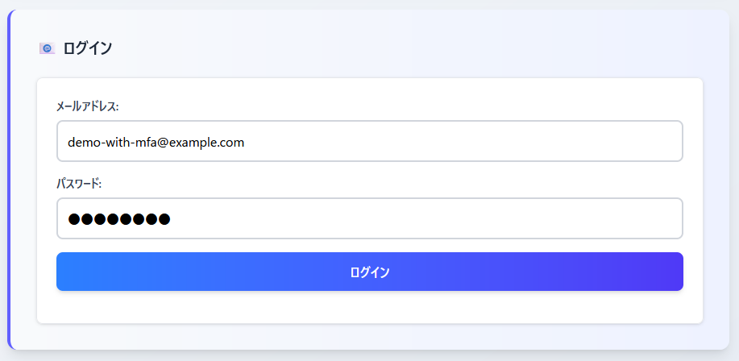

2. InitiateAuth の API リクエストのレスポンスが `ChallengeName` を含む追加の認証を必要とするものであることを確認

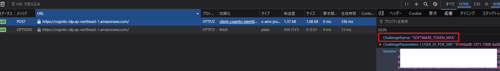

3. Authenticator アプリに表示される6桁のコードを確認して入力

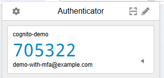

↓

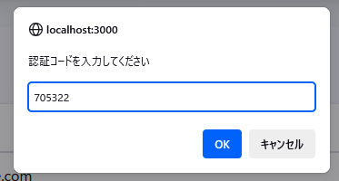

4. RespondToAuthChallenge の API リクエストのレスポンスとして `AuthenticationResult` を受け取れていることを確認

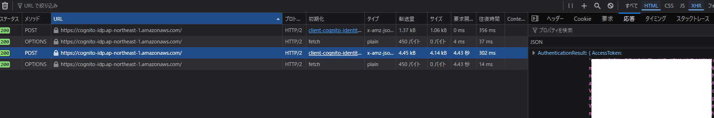

5. 認証結果に含まれる ID トークンをデコードして正しい情報が取得できていることを確認

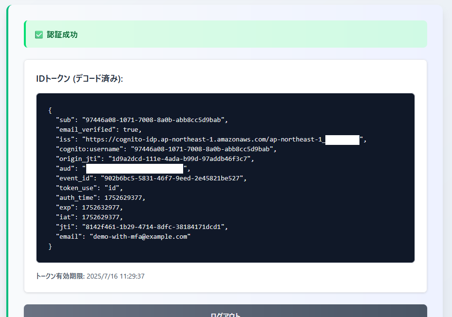


### マネージドログインから MFA 設定中のユーザーで認証

1. 検証ページ（/hosted-ui-verify.html）からマネージドログイン画面に遷移

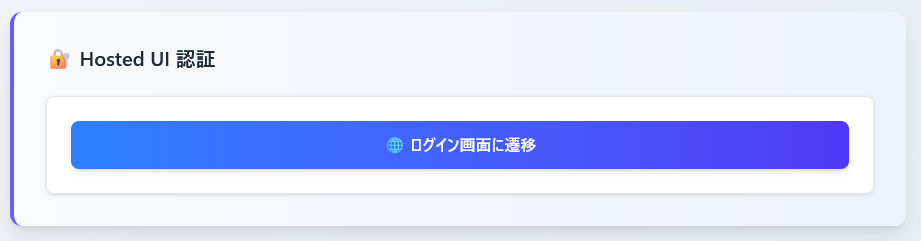

2. メールアドレスとパスワードを入力して「サインイン」をクリック

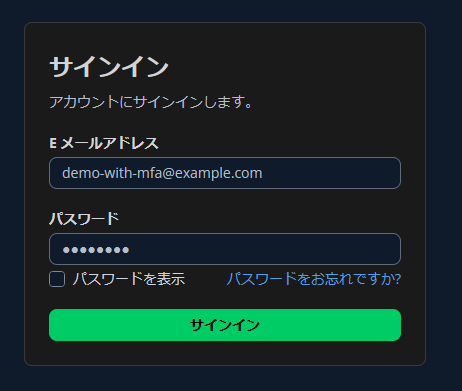

3. Authenticator アプリケーション MFA というコードの入力画面に遷移することを確認

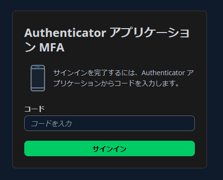

4. Authenticator アプリに表示される6桁のコードを確認して入力

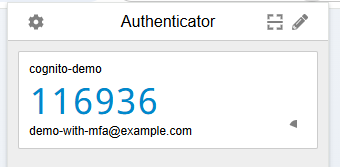

↓

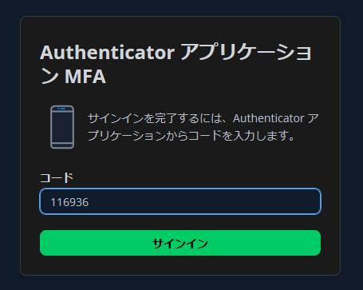

5. コールバック先の URL にコード付きで戻ってこれたことを確認

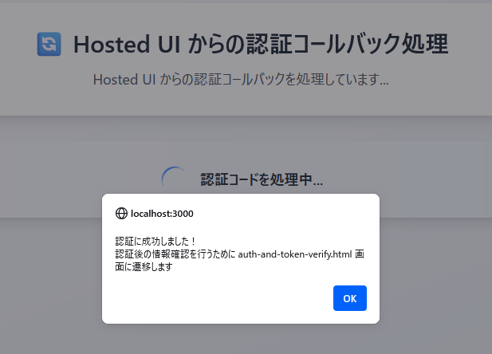

6. コードを元にしたトークンの取得が行えることも確認

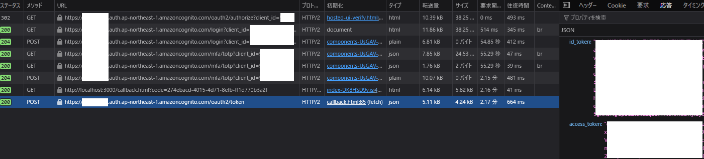

## まとめ

- MFA について Cognito ユーザープールの中でオプショナルな機能として設定し利用することができました
- Authenticator アプリを 使用した MFA についてアプリ内からとマネージドログインを使用した2パターンで認証を完了させることができました
- 今回は検証ということで Authenticator アプリの **シークレット作成、登録、検証** は aws-cli を介して実施しました。
  - 実際には認証後のユーザーのマイページ画面などで上記の **シークレット作成、登録、検証** の部分をアプリ内に作りこむ必要があるためその辺の考慮は別途必要となりそうです。
  - 認証の検証ページ内で使用している [@aws-sdk/client-cognito-identity-provider](https://www.npmjs.com/package/@aws-sdk/client-cognito-identity-provider) パッケージ内に **AssociateSoftwareToken**、**VerifySoftwareToken** などの API があるのでこれを利用することで実現可能と思われます