# setup_update-user-attributes

こちら setup_managed-login.md の後の検証になります。

ユーザープールで標準で管理されている各種属性について Read / Update / Delete を検証するページ（/update-user-attributes.html）を新設、検証を進める

## 開発について

- この記事を書いている時点において AWS のリソースに関する設定変更などは特になし
- Read / Update / Delete はそれぞれ [@aws-sdk/client-cognito-identity-provider](https://www.npmjs.com/package/@aws-sdk/client-cognito-identity-provider) パッケージを使用して開発（詳細は update-user-attributes.html 参照）

## ここまでの動作確認1

### アプリ内で認証したユーザーで検証

1. `admin@example.com` ユーザーで認証

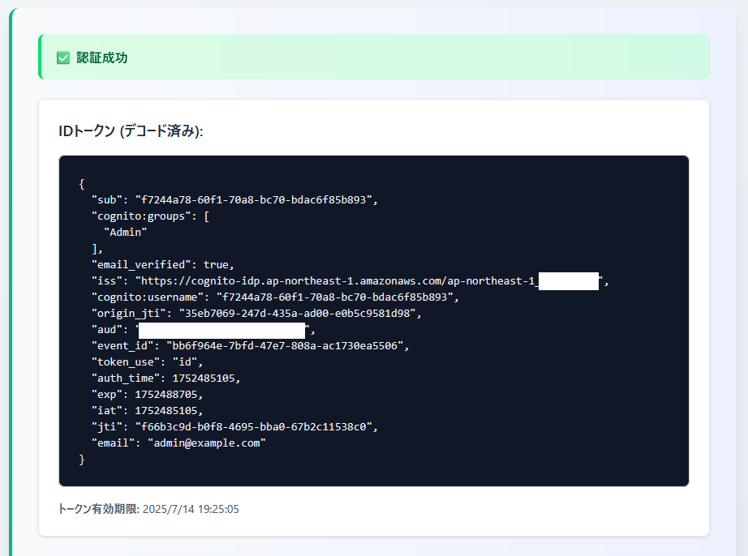

2. 新設したページ（/update-user-attributes.html）にアクセス

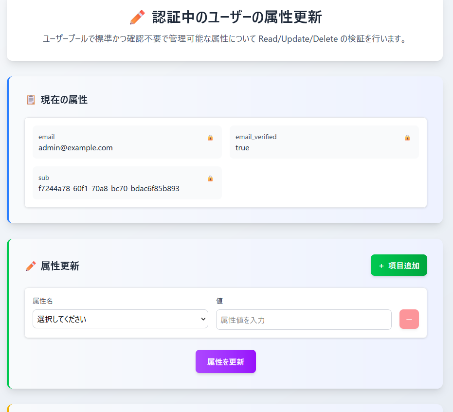

- 初期表示として設定済みの属性（email、email_verified、sub）の情報を取得できることを確認

3. 属性更新欄で適当な属性を選択、それに対応する値も入力して「属性を更新」をクリック

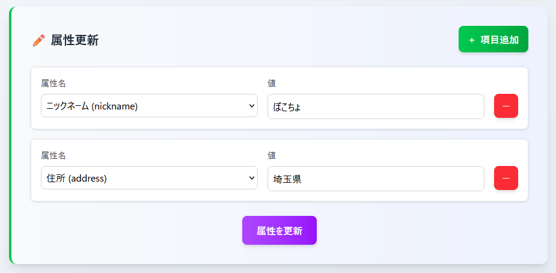

↓

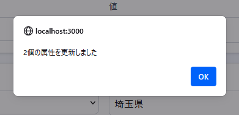

↓

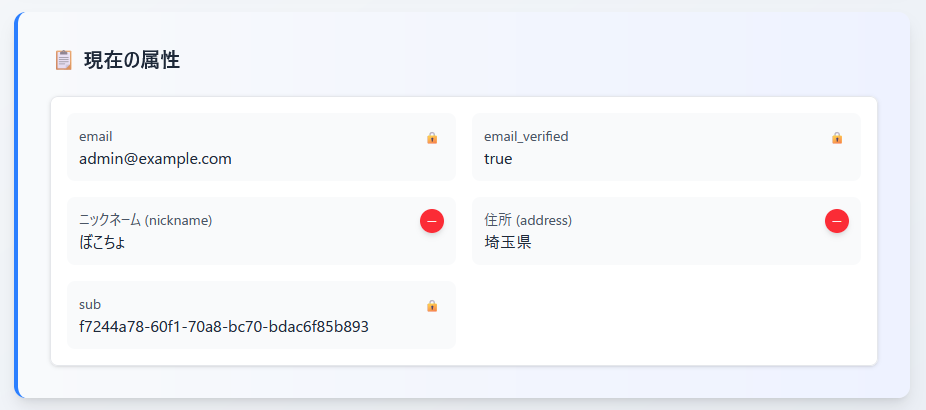

- 正常に更新が行えること
- 追加した属性について現在の属性の再取得によって表示に反映されていること

などを確認

4. 追加した属性について現在の属性欄の「-」ボタンをクリック

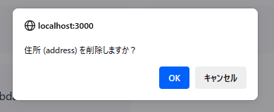

↓

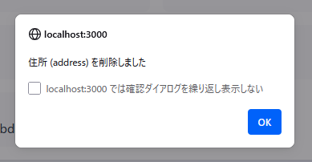

↓

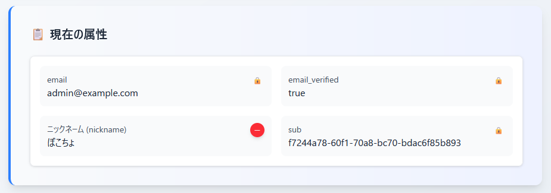

- 正常に削除が行えること
- 削除した属性について現在の属性の再取得によって表示に反映されていること

などを確認（ついでにニックネームも削除した）

### マネージドログインで認証したユーザーで検証

1. `admin@example.com` ユーザーで認証

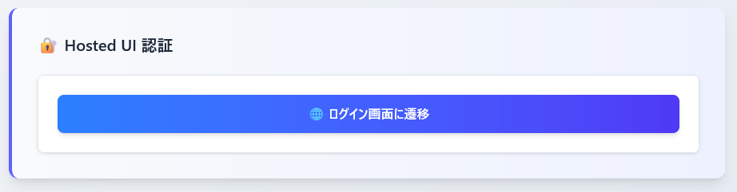

↓

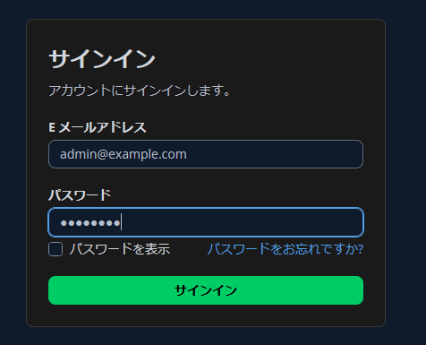

↓

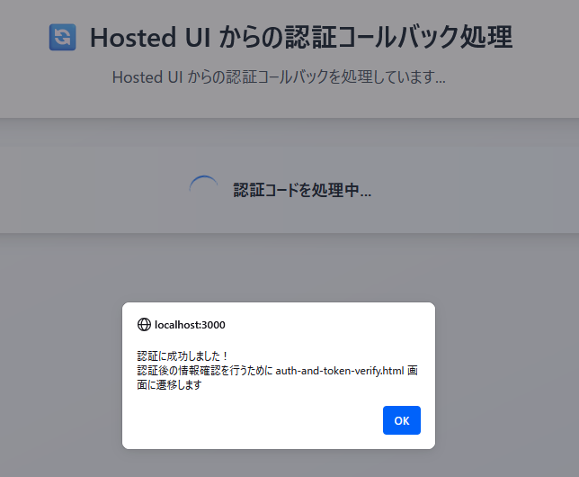

↓

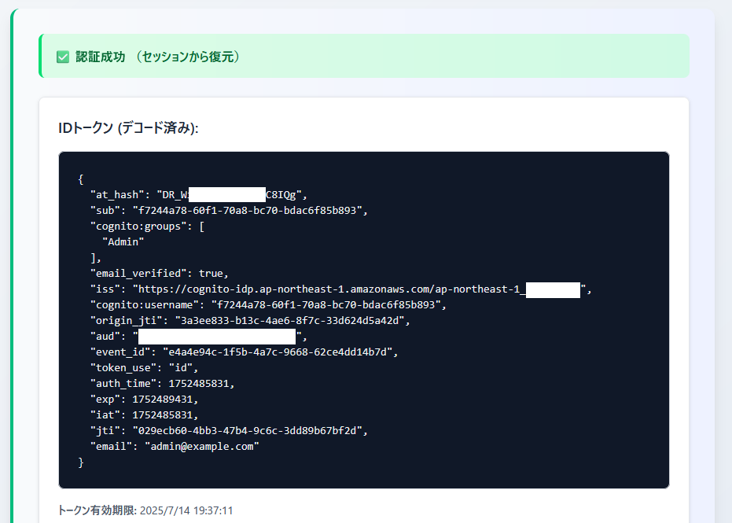

2. **新設したページにアクセスしたところエラーになってしまった...**

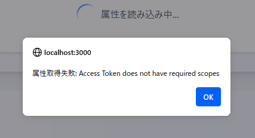

- `Access Token does not have required scopes` というエラーメッセージが出ている状態
  - 初期表示（GetUserCommand を使用した既存の属性取得）に失敗している状況
  - エラーメッセージ的にマネージドログインで認証したユーザーのアクセストークンに GetUserCommand での情報取得を行うのに必要なスコープが足りてないという状況みたい
- 一応何度かページをリロードしても再現することを確認

## マネージドログインで認証したユーザーで属性取得が行えない件について解決

調べた結果 `aws.cognito.signin.user.admin` というスコープが足りてないことが原因であることがわかった

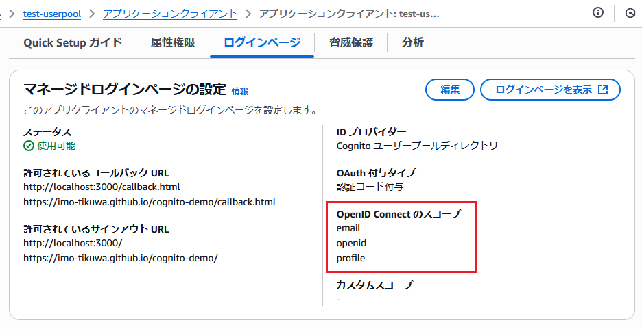

- アプリクライアントの「ログインページ」タブでマネージドログインに関する設定を確認

---

マネージドログインの設定編集画面を開いた状態

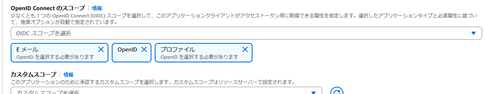

↓

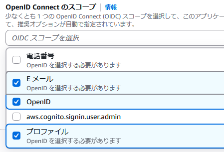

- **OpenID Connect のスコープ** の選択肢の中にある `aws.cognito.signin.user.admin` というスコープを選択する必要があるみたい

---

更新は aws-cli を通して実施（`※既存の設定も維持する必要があるため以下のようなコマンドでの更新となった`）

```bash
$ USER_POOL_ID=[ユーザープールID]
$ APP_CLIENT_ID=[アプリクライアントID]

$ aws cognito-idp update-user-pool-client \
  --user-pool-id ${USER_POOL_ID} \
  --client-id ${APP_CLIENT_ID} \
  --supported-identity-providers "COGNITO" \
  --allowed-o-auth-flows-user-pool-client \
  --allowed-o-auth-flows "code" \
  --allowed-o-auth-scopes "openid" "email" "profile" "aws.cognito.signin.user.admin" \
  --callback-urls "http://localhost:3000/callback.html" "https://imo-tikuwa.github.io/cognito-demo/callback.html" \
  --logout-urls "http://localhost:3000/" "https://imo-tikuwa.github.io/cognito-demo/" \
  --explicit-auth-flows "ALLOW_USER_PASSWORD_AUTH"
```

---

更新後のアプリクライアントの「ログインページ」タブの様子

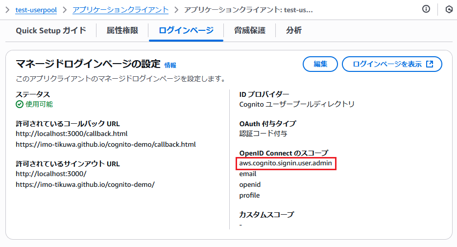

- **OpenID Connect のスコープ** に `aws.cognito.signin.user.admin` スコープが追加できた

---

上記の Cognito 側の設定変更と合わせてアプリ側も認証URLを生成するコードについて以下の通り修正

```diff
export function generateAuthURL(config, hostedUIConfig) {
  const currentOrigin = window.location.origin;
  const basePath = window.location.pathname.includes("/cognito-demo/")
    ? "/cognito-demo"
    : "";
  const redirectUri = `${currentOrigin}${basePath}/callback.html`;

  const authUrl = new URL(`${hostedUIConfig.domain}/oauth2/authorize`);
  authUrl.searchParams.set("client_id", config.clientId);
  authUrl.searchParams.set("response_type", "code");
  authUrl.searchParams.set("redirect_uri", redirectUri);
-  authUrl.searchParams.set("scope", "openid email profile");
+  authUrl.searchParams.set(
+    "scope",
+    "openid email profile aws.cognito.signin.user.admin"
+  );
  authUrl.searchParams.set("lang", "ja");

  return authUrl.toString();
}
```

## ここまでの動作確認2

`※アプリ内からの認証については特に問題なく動作することを確認済み`

---

1. 改めてマネージドログインから認証を実施

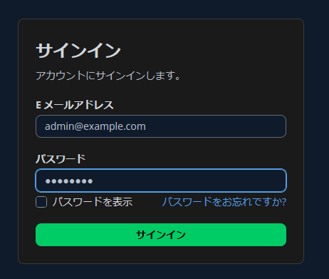

↓

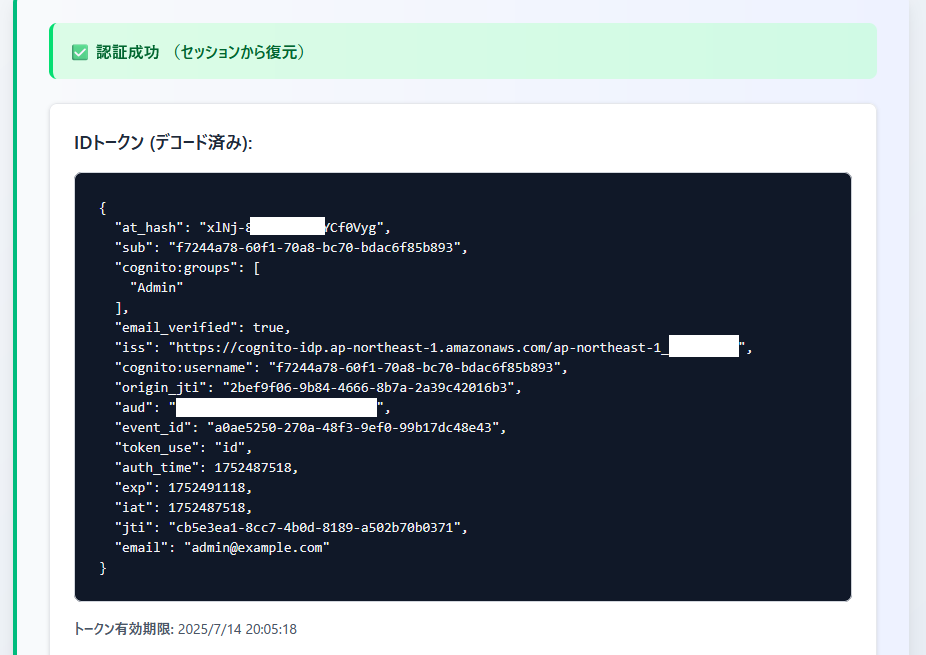

- ID トークンの中身にはこれと言って変化なし

2. GetUserCommand を使用した属性取得に使用するのはアクセストークンの方。アクセストークンについて確認

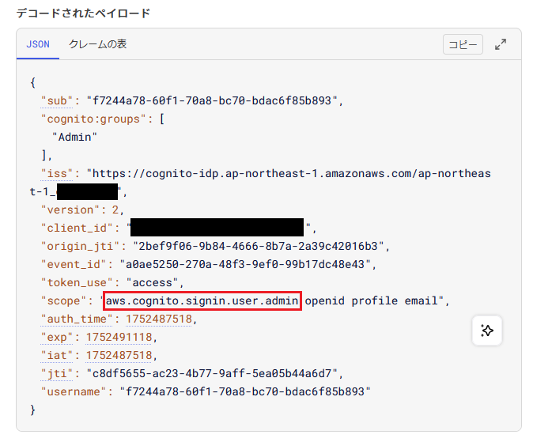

- トークンの確認についてページを新設するのは手間なので開発者ツールからセッションストレージを覗いてコピー、[jwt.io](https://jwt.io/) で確認
- ペイロード内の `scope` に `aws.cognito.signin.user.admin` の存在を確認

3. 改めて認証中のユーザーの属性を更新する画面を開く

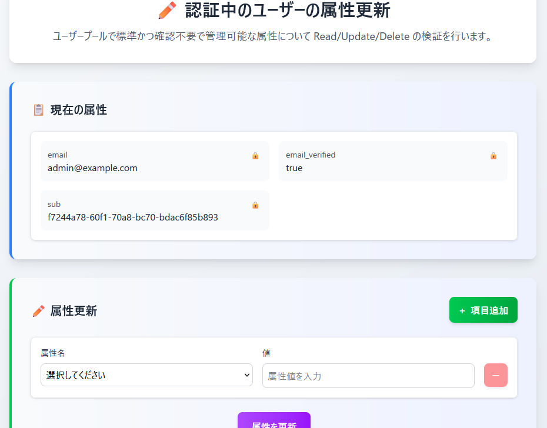

- 前回表示された `Access Token does not have required scopes` というエラーが出なくなり、属性情報の取得が正常に動作することを確認

4. 属性の更新が行えることを確認

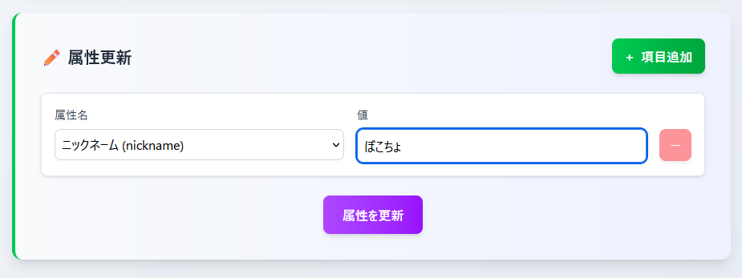

↓

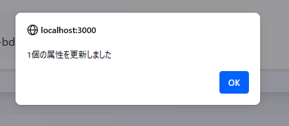

↓

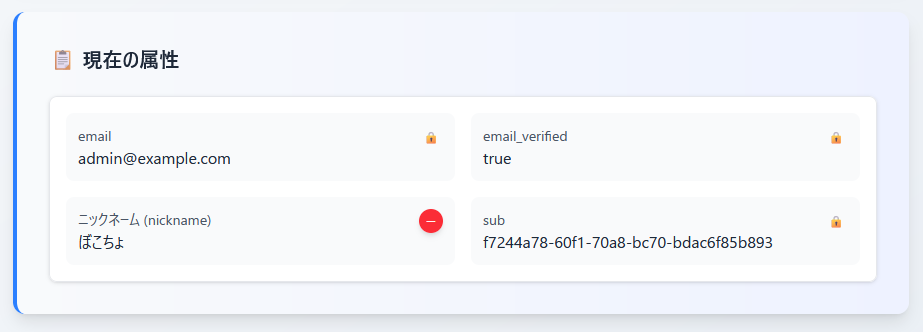

5. 属性の削除が行えることを確認

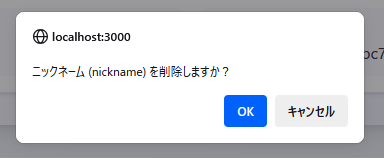

↓

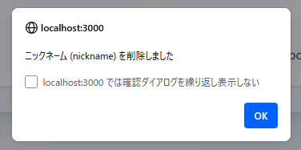

↓

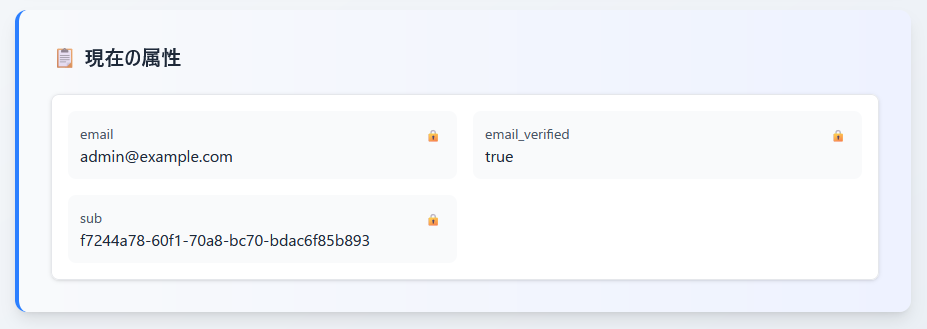

**マネージドログインで認証したユーザーでも属性の Read / Update / Delete が行えることが検証できました！**
